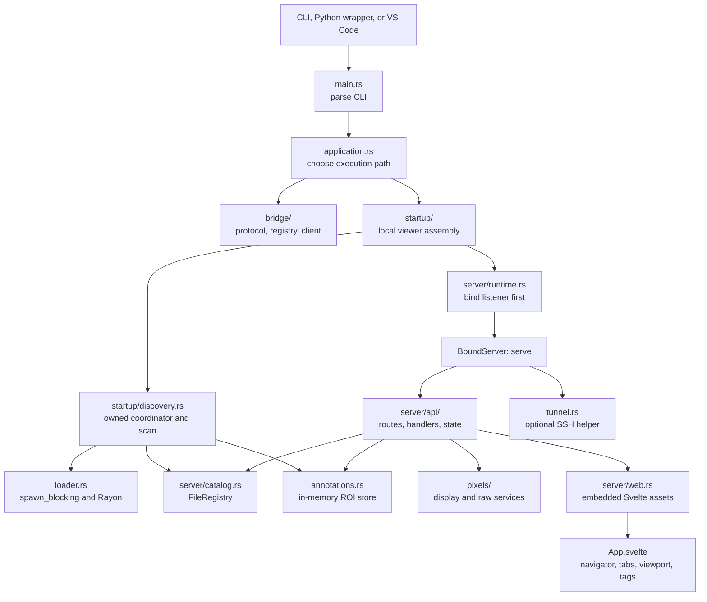
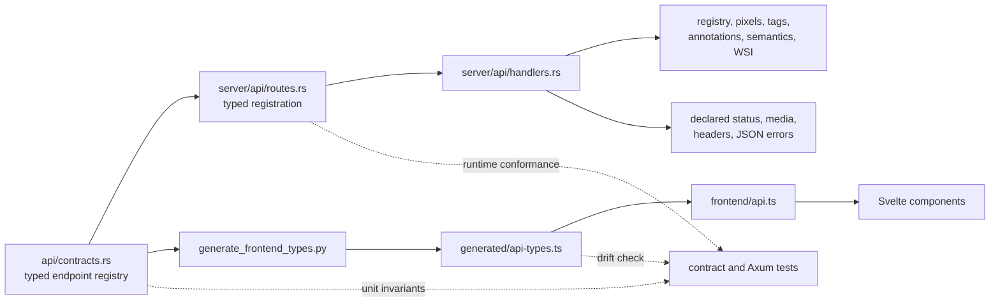
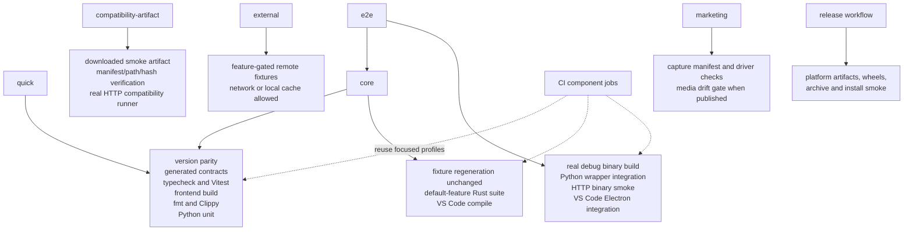
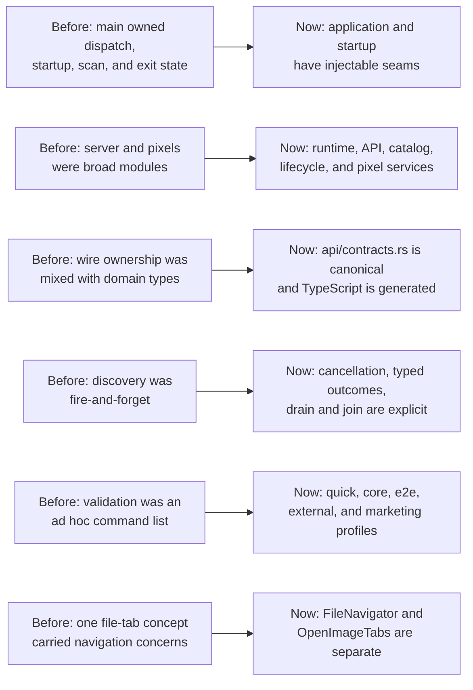

# dcmview Architecture

This document is the normative current-state architecture and testing model for
the repository. Update it when module ownership, dependency direction, HTTP
contracts, lifecycle ownership, or the canonical check profiles change.

`dcmview` is an ephemeral research and development viewer. The Rust binary is
the product center; the Svelte frontend is embedded into that binary, and the
Python and VS Code integrations launch or route to the same executable.

## Assessment

The codebase is organized around explicit seams rather than one application
module:

| Boundary | Owner | Stable contract or seam |
|---|---|---|
| Process dispatch | `src/application.rs` | `ApplicationServices` selects hidden bridge, workspace bridge, or local viewer without starting unrelated subsystems. |
| Local startup | `src/startup/` | `LocalViewerOptions`, `LocalViewerOutcome`, `DiscoveryHandle`, and `DiscoverySpawner`. |
| HTTP wire model | `src/api/contracts.rs` | Typed endpoint registry, wire structs, query names, response header names, and error envelope. |
| HTTP runtime | `src/server/` | Listener/runtime, route registration, handlers, state, registry, activity tracking, tags, and embedded assets. |
| Pixel service | `src/pixels/` | Typed display/raw requests, cache behavior, transfer-syntax classification, decoding, rendering, and `PixelError`. |
| Patient geometry | `src/geometry.rs` | Normalized per-frame position, orientation, pixel spacing, coplanarity checks, and target-to-source pixel transforms. |
| DICOM references | `src/references.rs` | Bounded extraction of typed instance relationships without implying target presence or semantic rendering. |
| Semantic context | `src/semantic.rs` | Conservative SEG, Parametric Map, and RT Dose metadata interpretation layered beside unchanged pixel preview. |
| WSI tile context | `src/wsi.rs` | Bounded positioning of one selected WSI tile without stitching or Total Pixel Matrix reconstruction. |
| DICOM discovery | `src/loader.rs` | Progressive events, cancellation, reports, metadata filters, and `FileEntry` construction. |
| Frontend client | `frontend/src/api.ts` | Typed fetch wrappers over generated endpoint metadata and wire types. |
| Cross-language generation | `scripts/generate_frontend_types.py` | Checked-in `frontend/src/generated/api-types.ts` derived from the Rust HTTP contract. |

The current separation is suitable for informative automated tests. Unit tests
can replace process dispatch and discovery production services, Axum integration
tests can execute a router without a process, and end-to-end profiles still
exercise a real binary where process behavior matters.

## Runtime And Module Flow

### Ownership And Dependency Direction

The binary-private orchestration modules depend on the reusable library
modules, not the reverse:

1. `main.rs` owns the Clap shape and process exit only.
2. `application.rs` owns dispatch order and tracing initialization. It tries the
   hidden bridge mode, then workspace bridge routing, then local startup.
3. `startup/mod.rs` validates local options and the annotation CSV header, constructs
   `FileRegistry`, `AnnotationStore`, `AppState`, and `ServerConfig`, binds the
   listener, starts discovery, serves, and joins discovery before returning.
4. `startup/discovery.rs` translates loader events into registry updates, then
   owns the cancellable blocking annotation pass. It does not own HTTP routing.
5. `server/runtime.rs` owns listener, browser, tunnel, and graceful-shutdown
   resources. `server/api/` owns HTTP concerns. `server/catalog.rs` owns the
   progressive file registry.
6. `pixels/service.rs` is the server-facing pixel boundary. Codec, cache,
   rendering, and window modules remain below it. `pixels/native_layout.rs`
   validates native frame sizing and normalizes bit-packed, planar, subsampled,
   and endian-sensitive storage before display decoding. `pixels/overlay.rs`
   and `pixels/shutter.rs` own bounded native presentation compositing;
   `pixels/segmentation.rs` owns SEG mask decoding and patient-coordinate
   nearest-neighbor resampling; `pixels/rle.rs` owns the bounded Annex
   G/PackBits path.

`src/api/contracts.rs` owns browser-visible wire declarations. `src/types.rs`
owns internal DICOM, cache-key, transfer-syntax, and windowing domain types; it
re-exports selected wire types for compatibility but is not their source of
truth.

The frontend root is `App.svelte`. It composes `FileNavigator`,
`OpenImageTabs`, `ViewerToolbar`, `ImageViewport`, `FrameSlider`, `TagPanel`,
`ReferenceNavigator`, and `StatusBar`. `ReferenceNavigator` retains declared
identity when a target is absent and routes validated local file/frame matches
through the same tab and stack state as ordinary navigation; it does not imply
semantic rendering of the referencing object. Components use
`frontend/src/api.ts`; new endpoint fetches should not be introduced directly
inside components.

For SEG objects, `SemanticContextPanel` keeps Pixel Preview as the initial mode
and publishes an explicit Semantic Context selection to `App.svelte`.
`ImageViewport` composes the referenced display PNG with the transparent SEG
overlay only when the selected SEG frame has one validated source-frame
mapping. The active logical frame remains the SEG frame; source identity and
geometry come from the mapping. ROI editing, interactive window/level, and cine
are disabled for the composed view because their existing state belongs to the
SEG object or requires a separate source-window contract.

`FileNavigator` owns the active clinical-versus-directory organization and
publishes the corresponding flattened file order to `App.svelte`. Global
Up/Down shortcuts use that order (including the active filter), so file
selection follows the explorer presentation rather than registry insertion
order.

`App.svelte` gives `ImageViewport` one ordered logical-frame sequence for the
active tab. A sequence may describe frames from one multiframe object, many
single-frame CT/MR objects, or a mixture of both. Viewport display and raw
resources are keyed by source file/frame identity but retained for the logical
tab lifetime, so crossing a source-file boundary does not clear already loaded
frames. Raw foreground and prefetch consumers share one in-flight request per
source frame; consumer navigation does not cancel reusable work, while logical
tab teardown aborts the request registry. Display resources use independent
byte-budgeted LRU tiers: a 320 MiB compressed PNG payload cache and a 128 MiB
decoded RGBA bitmap working set. Bitmap eviction closes only the decoded browser
resource and preserves its PNG for local re-decoding. Background display
prefetch fills the PNG tier without eagerly decoding every frame. These byte
budgets are the only active-stack discard policy; near-frame prefetch does not
prune previously visited frames. Cine resolves logical positions to source
frames and uses the same prepare-then-render cache path as manual navigation.

## Executable HTTP Contract

The endpoint registry declares the operation, method, path, query type, request
type and media type, response type and media type, response-header kind, error
type, and success status for every `/api` operation. Route registration matches
each operation to a handler with compile-time request and response constraints.

The executable contract is kept consistent by three layers:

- Rust contract tests check registry uniqueness, type relationships, query
  names, and header names.
- Axum integration tests execute every declared endpoint and compare its
  status, media type, and required response headers. Boundary rejections are
  also checked for the shared JSON error envelope.
- Frontend generation tests and `check:contracts` reject drift in generated
  endpoint metadata and TypeScript wire types.

### Endpoint Invariants

- Every API error is a JSON `ErrorResponse` shaped as
  `{"code":"stable_machine_code","error":"human-readable detail"}`. Codes are
  owned by `ApiErrorCode` in the canonical Rust contract; messages may add
  context without changing automation behavior.
- `/api/health` exposes the package version plus build source revision, target,
  and profile so compatibility evidence can identify the tested viewer build.
- `/api/files` exposes a response-bounded view of the 256 most recent entries
  in the memory-only discovery ledger and each file's SOP Class, coarse object
  kind, and explicit `renderable`, `metadata_only`, or `unsupported` state with
  a stable reason when applicable. Exact scan totals remain separate. These
  states describe viewer capability, not DICOM conformance.
- `/api/series` builds an ephemeral server-owned catalog grouped strictly by
  Study and Series UID. Its typed stacks map virtual positions to source file
  and frame, prefer patient-geometry ordering for classic slices, surface
  geometry-quality warnings, use concatenation offsets for enhanced parts, and
  keep WSI pyramid levels and non-member companions distinct.
- `/api/file/{index}/references` extracts bounded typed relationships on a
  blocking worker and resolves targets against the current registry by stable
  SOP/Series identity. Declared one-based frame numbers remain visible while
  local navigation matches contain only validated zero-based frames; missing
  targets remain explicit empty matches.
- `/api/file/{index}/semantic-context` reads declared SEG, Parametric Map, and
  RT Dose meaning without modifying decoded pixels. For SEG frames, explicit
  per-frame derivation references take precedence. When those are absent, the
  resolver can match top-level declared source instances by Frame of Reference
  and per-frame patient geometry, including classic series split across many
  SOP Instances. Each result reports its mapping method and status. Pixel
  preview remains the default, every frame must resolve uniquely for aggregate
  overlay eligibility, and absent, ambiguous, or incompatible metadata is
  reported explicitly rather than inferred.
- `/api/file/{index}/frame/{frame}/segmentation-overlay` accepts one SEG frame
  whose source mapping and geometry have been validated. It decodes binary or
  fractional SEG samples, maps pixel centers through patient coordinates, and
  returns a source-sized transparent PNG using nearest-neighbor mask sampling.
  Unavailable semantic mappings return `422 semantic_mapping_unavailable`;
  successful responses include `X-Cache` for the decoded SEG frame.
- `/api/file/{index}/wsi/frame/{frame}` returns bounded placement metadata for
  one selected tile. TILED_FULL uses deterministic raster placement;
  TILED_SPARSE uses per-frame plane positions. The contract exposes matrix,
  optical-path, focal-plane, and warning data but never promises stitching or
  slide reconstruction.
- `/api/file/{index}/tags/select` traverses explicit tag/item paths against the
  original object and pages sequence items, allowing targeted retrieval beyond
  legacy tag-tree preview caps.
- Path, query, and JSON extractor failures pass through the same envelope.
- Unknown `/api` routes return JSON `404`; unsupported methods return JSON
  `405`.
- Supported display frames return `image/png`; supported raw frames return
  `application/octet-stream`; annotation export returns
  `text/csv; charset=utf-8`.
- Every successful display or raw frame response includes `X-Cache: HIT` or
  `X-Cache: MISS`.
- Raw responses include all required `X-Frame-*` metadata headers. Default
  window headers are present only when the DICOM supplies a default window.
- Unsupported transfer syntaxes and raw layouts are `422`; missing pixels and
  out-of-range frames are `404`; decode failures are request-scoped `500`
  responses and do not stop the server.
- DICOMDIR is recognized by Media Storage Directory SOP Class and skipped with
  the stable `unsupported_media_directory` discovery reason while recursive
  discovery continues for ordinary objects. File-set hierarchy parsing and
  DICOM media support are intentionally not advertised.

Display cache keys include file, frame, normalized window parameters, and
window mode. Full-dynamic mode ignores explicit window values. Raw cache keys
include file and frame only. Cache locks are held for lookup or insertion, never
while reading DICOM, decoding, rendering, or encoding.

Native display decoding supports monochrome integer samples at 1, 8, 16, and
32 bits, Float Pixel Data, Double Float Pixel Data, 8-bit RGB in either planar
configuration, YBR_FULL, YBR_FULL_422, and palette color. Native raw responses
retain stored sample ordering (including planar configuration) while
normalizing multi-byte values to little endian. Integer sample fields are
masked to Bits Stored and signed values are extended from High Bit so unused
allocated bits never affect display or raw consumers; one-bit pixels are
expanded to one byte per sample. Float and double-float objects are pixel-renderable, but
real-world-value mapping remains a separate semantic capability rather than an
implicit part of the display pipeline.

The frontend uses raw frames for local interactive window/level when their
single-channel 8- or 16-bit layout is supported by the browser renderer. For
other server-renderable layouts (including one-bit, 32-bit, and floating-point
samples), selecting the window/level tool falls back to parameterized display
PNG requests instead of replacing the image with a raw-renderer error.

For supported 8-bit RGB display paths, a structurally valid source ICC profile
is preserved in the PNG `iCCP` chunk. The profile may come from the top-level
ICC Profile attribute or from Optical Path Sequence; nested profiles are used
only when every optical-path item supplies the same bytes. Missing or differing
optical-path profiles are omitted because the renderer does not yet prove a
frame-to-optical-path association. This is metadata preservation, not a numeric
color-space transformation, and it does not change decoded RGB samples or raw
frame responses.

For native monochrome display, Modality LUT or rescale precedes VOI LUT or
windowing, followed by MONOCHROME1 presentation inversion. Modality and VOI
LUT sequences accept the standard 8-bit and 16-bit entry depths, including
byte-packed 8-bit LUT Data. A validated rectangular shutter then replaces
pixels outside its one-based inclusive
opening with the encoded P-value, and standalone one-bit overlay planes are
composited last in DICOM LSB-first order. These presentation operations affect
PNG display frames only; raw-frame bytes remain the decoded source samples.

RLE Lossless decoding validates the 64-byte Annex G header, segment offsets,
PackBits runs, byte-plane counts, and decoded sizes before assembling a frame.
It supports 8/16-bit monochrome plus common 8-bit RGB, YBR_FULL, and palette
layouts. DICOM byte planes are interpreted in most-significant-byte-first
order; non-conforming files with reversed 16-bit planes are not silently
reinterpreted.

JPEG-LS Lossless `.80` uses the vendored CharLS build through
`dicom-pixeldata`; the supported path is 8-bit grayscale, while `.81` remains
unsupported. JPEG XL Lossless `.110` uses the pure-Rust codec graph and retains
all interleaved RGB channels in both PNG and raw output; `.111` and `.112`
remain unsupported until independently exercised. Deflated Explicit VR Little
Endian is a dataset encoding and routes through the native layout pipeline
after `dicom-object` inflates the dataset.

See [the HTTP API reference](api.md) for endpoint payloads and headers.

## Lifecycle And Discovery Ownership

Local startup follows a strict order:

1. Validate tunnel options and the optional annotation CSV header.
2. Construct state and configuration.
3. Bind `BoundServer`; an occupied explicit port fails before discovery starts.
4. Spawn the owned discovery scan and coordinator.
5. Serve until OS signal, external failure notification, or idle timeout.
6. Request discovery cancellation and await both Tokio tasks and the loader's
   `spawn_blocking`/Rayon work before returning.

The loader sends events through a bounded channel. The coordinator drains that
channel, updates `FileRegistry`, records skipped and filtered counts, and marks
the scan complete. It then streams the annotation CSV once on a cancellable
blocking worker, matching only loaded absolute path keys and committing valid
rows atomically without overwriting viewer edits. Annotation failures remain in
the annotation store and do not terminate image viewing. Scan and no-files
failures produce typed outcomes and a durable external shutdown notification.
Normal server exit during incomplete discovery or annotation loading requests
cancellation and remains a successful process outcome.

`RequestActivity` tracks in-flight requests and a monotonic idle baseline.
Idle timeout does not start while the registry is both empty and incomplete,
and graceful shutdown lets in-flight requests drain. Browser and tunnel tasks
are owned by `BoundServer::serve` and cleaned up on every normal return or
error.

`DiscoveryHandle::Drop` requests cancellation as a backstop. The supported
lifecycle is the explicit `cancel_and_wait` path; callers that later embed
startup in an abortable Tokio task must add a supervisor contract if they need
join guarantees after hard task abortion.

## Test Layers And Check Profiles

`scripts/check.py` is the canonical check entry point:

The supported development baselines are Rust 1.88+, Node.js 20.19+, and Python
3.9+. CI pins Rust 1.88 and the current Node 20 line.

| Profile | Intended use | Exact coverage |
|---|---|---|
| `quick` | Normal development loop | Version parity; generated frontend contract check; Svelte/TypeScript checks; Vitest; frontend build; Rust format and strict all-target Clippy; Python unit and packaging-helper tests. It does not run Rust tests or VS Code tests. |
| `core` | Before handing off a normal code change | Everything in the corresponding frontend/lint/unit layers, plus deterministic fixture regeneration that must leave the current fixture tree unchanged, the default-feature, non-ignored locked Rust suite, and VS Code compilation. |
| `e2e` | Process or integration changes | `core`, then a real debug binary, Python wrapper binary integration, debug-binary HTTP smoke, and VS Code Electron integration. |
| `compatibility-artifact` | Stored current corpus integration | Builds only the dcmview binary, verifies an explicitly supplied current external-corpus smoke artifact, and runs the existing HTTP compatibility runner against its DICOM files. It never checks out or builds the generator. The profile fails closed when `DCMVIEW_COMPAT_CORPUS_ROOT` is absent. |
| `external` | Opt-in upstream DICOM compatibility | Builds frontend assets and runs only ignored integration tests behind `remote-fixtures`; those tests may download or populate the `dicom-test-files` cache. It is separate from `e2e`. |
| `marketing` | Capture tooling and release media | Validates tracked source/capture manifests, syntax-checks the browser and VS Code capture drivers, runs marketing-media unit tests, and—once an approved bundle is committed—verifies published hashes and the capture-input digest without ignored DICOM sources. |

Pass `--install` when the profile should run `npm ci` for the frontend and, when
needed, VS Code dependencies. Without it, installed dependencies are reused.
CI invokes focused profiles in separate jobs so failures identify the affected
layer; the aggregate profiles remain the local source of truth. Dependency
installation and VS Code Electron integration can also use network/cache state;
`external` specifically denotes upstream DICOM fixture coverage.

### Test Seams

- `ApplicationServices` records dispatch calls without launching bridge or
  server processes.
- `DiscoverySpawner` drives completion, cancellation, annotation failure,
  scan failure, and no-files cases without filesystem timing.
- `BoundServer::bind` is separate from `serve`, so bind ordering and occupied
  ports are deterministic.
- `server::router(AppState)` supports in-process `axum-test` coverage for the
  complete HTTP boundary.
- Generated DICOM fixtures exercise real discovery and codec paths. Integration
  tests do not mock the DICOM layer.
- Discovery stops metadata parsing at the earliest standard pixel-data tag and
  scans native or deflated streams incrementally to classify the payload. It
  does not retain integer, float, or double-float pixel values in the catalog.
- Frontend state helpers, cache policy, windowing, registry shaping, and API
  wrappers are tested as TypeScript modules.
- Python unit tests isolate subprocess policy; `python-integration` adds the real
  binary. VS Code compile and Electron integration remain separate layers.
- The compatibility runner promotes manifest capabilities only from exact
  observations. Prepared diagonal overlays have an exact decoded-PNG pixel
  oracle. The current rectangular shutter fixture covers the full frame and
  therefore records bounds-preserving non-regression without claiming that
  outside-opening replacement was exercised. ICC evidence compares the
  decompressed PNG `iCCP` bytes to the manifest size and SHA-256, while leaving
  numeric color transformation and optical-path mapping explicitly unprobed.
- `scripts/compatibility` retains the checkout-based scope freezer for historical
  and broad campaigns, while `run.py --corpus-root` consumes one published
  current external-corpus smoke artifact without a generator or suite checkout.
  The artifact path accepts only manifest schema `2.0.0` smoke/profile output:
  it checks the declared seed, generator and feature identities, verified
  corpus-definition identity, safe relative paths, file sizes and SHA-256
  payload hashes, profile membership, and selection-ledger closure before
  launching the existing HTTP runner. The valid and legacy HTTP campaigns,
  isolated negative runner, stress baseline, and payload-free deterministic fuzz
  qualification produce separate bounded reports and SHA-256 artifact indexes.
  The stored-artifact profile is wired into CI only when its explicit artifact
  URL and identity pins are configured; it never regenerates corpus data. The
  companion `viewer-report.schema.json` is viewer-owned, so this path does not
  load a generator-owned schema from the artifact or a sibling checkout.
- Real-browser acceptance uses the actual Svelte app and fixture server to
  exercise canvas/network behavior: metadata-only and unsupported states,
  pixel-preview/semantic-context switching, typed references, SEG/Parametric
  Map/RT Dose context, WSI positioning, cine, windowing, viewport transforms,
  file switching, and recovery after request errors.
- `python/tests/test_check_profiles.py` locks the documented
  `quick`/`core`/`e2e` composition and the exact independent `external` command
  without launching toolchains.

### Intentionally External Coverage

- Two upstream `dicom-test-files` cases are ignored in normal Rust runs and live
  in the `external` profile because they can use network and cache state: one
  loader/API metadata case and one JPEG 2000 display/cache case. Committed JPEG
  2000 fixtures remain in normal coverage. No CI or release job invokes
  `external`.
- Release workflows, not `core`, prove platform archives, bundled wheels,
  installed console scripts, VSIX packaging, and release-binary smoke behavior.
- A real SSH server and institution-specific DICOM corpora are not committed
  test dependencies. Tunnel failure behavior uses controlled integration tests;
  broader compatibility is manual or reported with de-identified data.
- Performance targets require explicit timing and memory instrumentation. They
  are not inferred from mocked or ordinary correctness tests.

## Remediation Map

### Non-Blocking Extension Points

The approved structural remediations are complete. These are non-blocking
extension points, not current correctness blockers:

1. If local startup is ever exposed as an abortable library API, introduce an
   explicit supervisor/reaper contract for hard task abortion; the binary's
   current result-based lifecycle already joins its work.
2. Add opt-in performance benchmarks before enforcing startup, first-frame, or
   cache-memory thresholds in CI.
3. Keep external upstream fixtures opt-in unless their availability and cache
   behavior become deterministic enough for normal CI.
4. When adding an endpoint, change the Rust contract first, regenerate checked-in
   TypeScript, register the typed handler, and extend runtime contract tests.

## Maintainer Invariants

- Bind loopback by default; preserve warnings for non-loopback binds.
- Keep the server ephemeral: no database, persistent configuration, or DICOM
  mutation.
- Keep bridge and local startup mutually exclusive at the dispatch boundary.
- Bind before starting discovery, and join discovery on every supported server
  exit or error path.
- Keep CPU, codec, filesystem, and Rayon work off the async executor.
- Do not hold cache or registry locks across I/O, decode, encode, or await.
- Treat `src/api/contracts.rs` plus its generated TypeScript as one contract.
- Add endpoint fetches through `frontend/src/api.ts`.
- Use generated synthetic fixtures for integration coverage; never commit PHI.
- Run the narrow profile while iterating, then the profile required by the
  highest boundary changed.
- Keep the stored external-corpus consumer fail-closed: viewer CI may consume
  a downloaded artifact, but it must not acquire, build, or invoke
  `synth-dicom-gen`.
