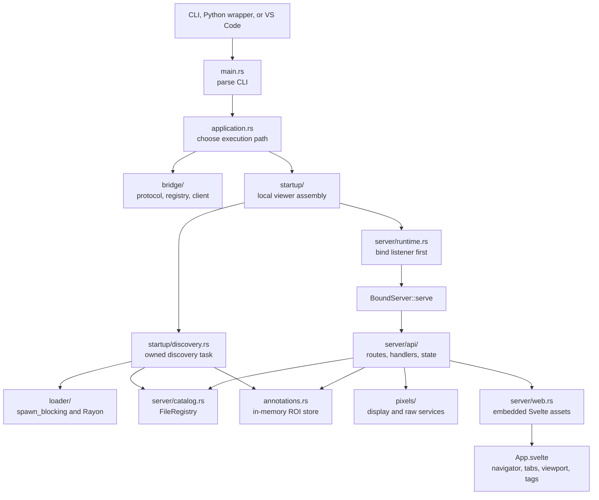
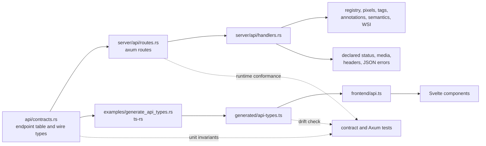
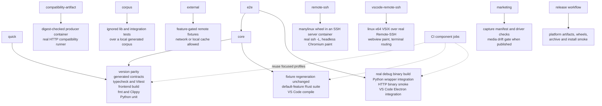

# dcmview Architecture

This document is the normative current-state architecture and testing model for
the repository. Update it when module ownership, dependency direction, HTTP
contracts, lifecycle ownership, or the canonical check profiles change.

`dcmview` is an ephemeral research and development viewer. The Rust binary is
the product center; the Svelte frontend is embedded into that binary, and the
Python and VS Code integrations launch or route to the same executable.

## Workspace

The repository is one Cargo workspace with one `Cargo.lock`. The root manifest
is both the workspace root and the `dcmview` package (the binary and its
library), so `cargo build`, `cargo install --path .`, `build.rs`, the wheel
build and the VS Code packaging use the same paths as a single-package
repository. Member crates under `crates/` hold what another crate or
repository may depend on without the viewer:

| Package | Path | Holds | Depends on |
|---|---|---|---|
| `dcmview` | `.` | The viewer binary and library. | Everything, including the members. |
| `dcmview-protocol` | `crates/dcmview-protocol` | The launch and startup contract: `StartupEvent` (with the `key_rules` number the viewer reports in it), `launch_url`, `STARTUP_PROTOCOL`, `TOKEN_FRAGMENT_PARAM`, `TOKEN_ENV_VAR`, and the test that pins the startup line. | `serde` only. No axum, tokio or DICOM crates. |
| `dcmview-annotation` | `crates/dcmview-annotation` | The neutral annotation model: file keys, file references, geometry, frame scopes, the label schema, labels, layers, annotations, the document, operations, and the validation of all of them. See [Annotation Model](#annotation-model). | `serde`, `serde_json`, `thiserror`, `uuid`, `ts-rs`, `schemars`. No axum, tokio, DICOM or pixel-pipeline crates; no filesystem or network access. |

Rules for the workspace:

- A member never depends on the root package.
- `[workspace.package]` in the root manifest owns edition, MSRV, license and
  project URLs; every package inherits them.
- Every member has the viewer's version. Other repositories pin a member by
  dcmview release tag, so the tag is the only version a consumer selects, and
  wire compatibility is carried by `STARTUP_PROTOCOL`, by the annotation
  document's `version` and by `KEY_RULES` rather than by the crate version. The root `[package].version` stays a literal because release
  tooling reads it; `scripts/check_versions.py` compares each
  `crates/*/Cargo.toml` with it.
- Plain `cargo build`, `cargo run` and `cargo test` at the root act on the
  root package only. `scripts/check.py` passes `--workspace` to Clippy and to
  the Rust test run so members are linted and tested; `cargo fmt --all`
  already covers them.
- Members are not published to crates.io (`publish = false`).

## Module Boundaries

The codebase is organized around explicit boundaries rather than one
application module:

| Boundary | Owner | Stable contract or seam |
|---|---|---|
| Process dispatch | `src/application.rs` | Routes a launch into VS Code through `bridge::launch_in_vscode` when the routing rule selects a bridge, otherwise runs the local viewer in-process. |
| Local startup | `src/startup/` | `LocalViewerOptions`, `LocalViewerOutcome`, and `DiscoveryHandle`. |
| HTTP wire model | `src/api/contracts.rs` | Plain `endpoints` table, media types, header names, wire structs (query names are `FrameQuery`/`TagQuery` fields), and error envelope. |
| Launch and startup contract | `crates/dcmview-protocol` | `StartupEvent` (the `--startup-json` line), `launch_url`, `STARTUP_PROTOCOL`, the token fragment parameter and the token environment variable. Re-exported by `src/api/contracts.rs`. Fields are only added. |
| Annotation model | `crates/dcmview-annotation` | The model's types and wire format, `validate` on each of them, `FileKey` and `KEY_RULES`, `Op` and `OpEnvelope`, the size bounds in `limits`, and the generated TypeScript and JSON Schema. The root package takes `FileKey` and `KEY_RULES` from it (`src/keys.rs`) and nothing else: `src/annotations.rs` is the EMBED store behind the annotation endpoints. |
| File keys | `src/keys/` | `KeyTable`: which key each loaded file has and whether it is settled, as a plain data structure with no I/O that holds no string per file. `FileHasher`: one file's BLAKE3 digest in bounded slices. See [File Keys And The Catalog Cursor](#file-keys-and-the-catalog-cursor). |
| HTTP runtime | `src/server/` | Listener/runtime, route registration, handlers, state, registry, activity tracking, tags, and embedded assets. `server/catalog.rs` holds the registry with its key table and catalog revisions; `server/catalog/keys.rs` holds background hashing and what a session shows for a key. |
| Pixel service | `src/pixels/` | Typed display, raw and thumbnail requests, cache behavior, transfer-syntax classification, decoding, the render seam (`render.rs` `DisplayBuffer`), decode classes (`schedule.rs`), and `PixelError`. `raster.rs` decodes PNG, JPEG, TIFF and WebP frames within fixed read and memory limits and renders them. |
| Patient geometry | `src/geometry.rs` | Normalized per-frame position, orientation, pixel spacing, coplanarity checks, and target-to-source pixel transforms. |
| Plane stacks | `src/plane_stack.rs` | RT Dose grids and Parametric Map frames as parallel planes; coverage and bracketing-plane sampling of a displayed frame. |
| Value mapping | `src/value_mapping.rs` | Per-frame Modality transform and Real World Value Mappings (or Dose Grid Scaling) that convert stored samples. |
| DICOM references | `src/references.rs` | Bounded extraction of typed instance relationships without implying target presence or semantic rendering. |
| Semantic context | `src/semantic.rs` | Conservative SEG, Parametric Map, and RT Dose metadata interpretation layered beside unchanged pixel preview. |
| Presentation states | `src/presentation_state.rs` | PIXEL-unit graphic and text annotations of softcopy presentation states, and which image frames each annotation item applies to. |
| Display masking | `src/masking.rs` | `Masker`: the per-process keyed replacements of a `--mask` session (patient pseudonym, date shift, UID hash) and the tag rules, with the PS3.15 Table E.1-1 attribute list in `masking/profile.rs`. The registry holds it and masks the catalog as files register; handlers mask tag trees, semantic context and UID fields of other responses. |
| Redaction boxes | `src/redactions.rs`, `src/pixels/redaction.rs` | `RedactionStore`: per-file boxes and their revision, in memory. The pixel service paints them into display PNGs and thumbnails (revision in the display and thumbnail cache keys), fills them in raw frame copies, and the presentation layer paints them too. |
| WSI tile context | `src/wsi.rs` | Bounded positioning of one selected WSI tile without stitching or Total Pixel Matrix reconstruction. |
| Attribute readers | `src/dicom_values.rs` | Lenient string, number, and sequence readers shared by discovery, references, semantic context, and WSI context. |
| File discovery | `src/loader/` | `discovery.rs` progressive events, cancellation, and reports; `entry.rs` format detection from content and DICOM `FileEntry` construction; `format.rs` the `--formats` selection and raster signatures; `raster.rs` header-only inspection of PNG, JPEG, TIFF and WebP into a `FileEntry`; `metadata.rs` geometry, LUT, overlay, and shutter extraction; `filter.rs` `--filter` predicates. |
| Frontend client | `frontend/src/api.ts` | Typed fetch wrappers over the generated endpoint paths and wire types. |
| VS Code extension | `vscode/src/` | `extension.ts` wires activation only. `viewerSessions.ts` owns viewer processes and their webview panels; `customEditor.ts` and `commands.ts` open files through it; `bridgeServer.ts` serves the loopback launch/stop/wait bridge; `bridgeRegistry.ts` publishes and refreshes the registry file; `terminalInterception.ts` sets the terminal environment and PATH shims. |
| Cross-language generation | `examples/generate_api_types.rs` | Checked-in `frontend/src/generated/api-types.ts` rendered with `ts-rs` from the Rust HTTP contract. |
| Annotation model generation | `crates/dcmview-annotation/examples/generate_annotation_model.rs` | Checked-in `frontend/src/generated/annotation-types.ts` (`ts-rs`) and `crates/dcmview-annotation/schema/dcmview.annotations.schema.json` (`schemars`), rendered from the model's serde attributes. |

Axum integration tests execute the router without a process; discovery and
lifecycle tests drive the real loader; end-to-end profiles exercise a real
binary where process behavior matters.

## Runtime And Module Flow

```mermaid
flowchart TD
    launch["CLI, Python wrapper, or VS Code"] --> main["main.rs<br/>parse CLI"]
    main --> app["application.rs<br/>choose execution path"]
    app --> bridge["bridge/<br/>protocol, registry, client"]
    app --> startup["startup/<br/>local viewer assembly"]
    startup --> bind["server/runtime.rs<br/>bind listener first"]
    startup --> discovery["startup/discovery.rs<br/>owned discovery task"]
    discovery --> loader["loader/<br/>spawn_blocking and Rayon"]
    discovery --> registry["server/catalog.rs<br/>FileRegistry"]
    discovery --> annotations["annotations.rs<br/>in-memory ROI store"]
    bind --> runtime["BoundServer::serve"]
    runtime --> router["server/api/<br/>routes, handlers, state"]
    router --> pixels["pixels/<br/>display and raw services"]
    router --> registry
    router --> annotations
    router --> web["server/web.rs<br/>embedded Svelte assets"]
    web --> ui["App.svelte<br/>navigator, tabs, viewport, tags"]
```

### Ownership And Dependency Direction

The binary-private orchestration modules depend on the reusable library
modules, not the reverse:

1. `main.rs` owns the Clap shape and process exit only.
2. `application.rs` owns dispatch and tracing initialization (`RUST_LOG`
   overrides the default filter; logs go to stderr, since stdout carries the
   `--startup-json` lines). It unwraps the
   hidden `--vscode-bridge-client <program> <args>...` form used by the terminal
   shims and the Python wrapper, then tries the VS Code bridge, then falls back
   to local startup in the same process. Bridge routing follows one rule for
   every entry point: a process with the bridge environment (a VS Code
   terminal) may use any live bridge; any other process routes only when its
   working directory is inside a registered workspace folder. A launch that
   reached a bridge without confirmation exits instead of starting a second,
   local viewer. Before a launch, each endpoint is probed unauthenticated: the
   bridge answers `401 {"error":"unauthorized"}`. Any other answer, a closed
   connection, or a refused one marks the entry stale and removes it; no answer
   in time falls through without removing it.
3. `startup/mod.rs` validates local options and the annotation CSV header, constructs
   `FileRegistry`, `AnnotationStore`, `AppState`, and `ServerConfig`, binds the
   listener, starts discovery, serves, and joins discovery before returning.
4. `startup/discovery.rs` translates loader events into registry updates, then
   owns the cancellable blocking annotation pass. It does not own HTTP routing.
   The server announces its URL before discovery ends; with `--startup-json`
   a completed scan that found files also prints
   `{"type":"scan_complete","file_count":N}`, which the Python wrapper waits
   for before returning a non-blocking handle. The loader walks every input
   directory before inspecting candidates, bounds each file's `frame_count` by
   the frames it can hold, and counts skips by reason for the summary.
5. `server/runtime.rs` owns listener, browser, and graceful-shutdown
   resources. The listener is TCP or, with `--unix-socket`, a Unix socket
   owned by `server/unix_socket.rs`: it binds only in a directory the
   effective user owns and no one else can write, restricts the socket to
   its owner, admits only connections from the same uid, and removes the
   socket file it created on shutdown. Ownership of the path is an exclusive
   `flock` on `<socket>.lock` held for the life of the listener: an existing
   socket is replaced only by a process holding that lock, never because a
   connection attempt was refused, so a busy or hung viewer is not displaced. Both listeners serve the same router.
   A socket launch always runs the local viewer and never opens a browser. `server/api/` owns HTTP concerns. `server/catalog.rs` owns the
   progressive file registry.
6. `pixels/service.rs` is the server-facing pixel boundary. Codec, cache,
   rendering, and window modules remain below it. A cache miss registers an
   in-flight decode that later requests for the key await; the decode runs as
   its own task and caches its result even if its client disconnected, and
   `schedule.rs` bounds concurrent decodes to the core count and grants
   permits by decode class (see "Render Seam, Thumbnails And Decode
   Classes"). The frame caches are bounded by bytes only. Grayscale 8- and 16-bit frames are presented through
   a per-stored-value lookup table (`render.rs`), with automatic windows from a
   histogram of stored values. `pixels/native_layout.rs`
   validates native frame sizing and normalizes bit-packed, planar, subsampled,
   and endian-sensitive storage before display decoding. `pixels/overlay.rs`
   and `pixels/shutter.rs` own bounded native presentation compositing;
   `pixels/segmentation.rs` owns SEG mask decoding and patient-coordinate
   nearest-neighbor resampling; `pixels/rle.rs` owns the bounded Annex
   G/PackBits path. `pixels/syntax.rs` owns the codec table that both frame
   dispatch and support classification read, including which color layouts
   each codec converts.

`src/api/contracts.rs` owns browser-visible wire declarations and re-exports
the launch and startup contract that `crates/dcmview-protocol` owns.
`src/types.rs`
owns internal DICOM, cache-key, transfer-syntax, and windowing domain types; it
re-exports selected wire types for compatibility but is not their source of
truth.

The frontend root is `App.svelte`. It composes `FileNavigator`,
`OpenImageTabs`, `ViewerToolbar`, `ImageViewport`, `FrameSlider`, `TagPanel`,
`ReferenceNavigator`, and `StatusBar`. `ReferenceNavigator` retains declared
identity when a target is absent and routes validated local file/frame matches
through the same tab and stack state as ordinary navigation; it does not imply
semantic rendering of the referencing object. Each declared edge renders through
`ReferenceEdge`, which `SemanticContextPanel` (RT Dose plan, structure set, and
image references) and `WsiTileContext` (slide relationships) reuse; WSI
companions open through the same `openReference` path. Components use
`frontend/src/api.ts`; new endpoint fetches should not be introduced directly
inside components.

`App.svelte` owns the shared root state through controllers in
`frontend/src/lib/app/` (catalog polling, tab and stack navigation, window
settings, value overlays, sidebar layout) and the per-tab `ViewStates` store
(zoom, pan, orientation). Catalog polling applies a response only when the
scan has moved, fetches the series catalog only when the file list or scan
state changed, and backs off to 2 s while nothing changes. A request that
cannot reach the server marks it disconnected in the status bar. Retry checks
health against the loaded catalog's server identity: a replaced server reloads
the page, while the same server resumes polling and retries failed active
resources. Every API response, including errors, carries `X-Server-Instance`;
`api.ts` rejects a differing identity before parsing its payload and App
reloads. No background health polling is added. Reference lists refresh as
discovery progresses and completes. Closing a tab forgets its zoom, pan and
orientation; switching between open tabs preserves them. One `svelte:window` keydown handler dispatches every global
shortcut through `lib/keyboardShortcuts.ts`. Keyed fetches share and abort
in-flight requests through `lib/keyedAsyncResource.ts`. `ImageViewport`
composes units in `frontend/src/lib/viewport/`: raw and display frame sources,
the window/level worker client, rendered-frame tracking for cine pacing,
per-frame overlay layers, the ROI annotation store and components, the
pixel probe and value-mapping conversions behind the readout, and the view
transform math, including the client-to-image-pixel mapping.

Pointer and wheel events go to one `viewport/ToolHost.svelte.ts`. It owns
pointer capture, the gestures every tool shares (middle-button pan, wheel pan
and zoom, pinch, with the wheel classified in one function), the cancel of a
frame-bound gesture when another file or frame is shown, and the tool that
holds the pointer. Each tool (Pan, Zoom, Scroll, W/L, and the rectangle tool
behind both ROI and Redact) is a state machine in `lib/annotation/tools/`
behind the `Tool` interface of `tool.ts`, with no Svelte in it. Tools reach
the viewport only through `ToolContext`, which the viewport implements over
its own state: the view transform, frame navigation, the live window of a
W/L drag, and the rectangles being edited. The host exposes what the tool
holding the pointer is drawing (the draft rectangle). The viewport keeps
rendering, the readout, and the overlays, the presentation state's
annotations among them.

The viewport retains the last complete presentation until its replacement is
ready. `viewport/frameLayers.ts` shares cached colorwash and presentation
payloads and owns decoded layers for each prepared frame. Raw and display
prefetches also warm value mappings and colorwash. A raw frame carries its
own mapping through the worker draw; the completed draw commits its layers,
window, and frame label together. Display frames await their colorwash before
drawing and committing. Display prefetch (within its 48-frame neighbourhood,
inside the 128-frame mapping cache) and cine also wait for each frame's
value mapping (reloading one the mapping cache evicted), so the HUD and legend
keep that frame's real-world unit; a frame navigated to directly is drawn
without waiting, and its HUD and legend update when its mapping arrives. A failed presentation layer leaves the base image
visible with an unavailable note. Cine advances only after that complete
presentation is marked rendered.

The pixel readout reads the frame on screen: the samples the window/level
renderer already holds, or a raw frame fetched through the shared raw-frame
source once the cursor rests, converted with that frame's `value-mapping`.
Frames too large to fetch for one value (over 4 Mpx, or over 0.25 Mpx that the
raw renderer cannot window and so does not cache) are read one pixel at a time
through `raw/pixel`, unless the renderer already holds them.
With a value overlay shown it adds the overlay's value from the frame's
`/values` grid, fetched once per frame while the cursor is on the image.

A real-world mapping also switches the window to its unit, and
`WindowSettings` records a drag in that unit. Display requests keep the
window in its unit (it is part of the fetch scope and cache key), and the
viewport's display loader converts each frame, including prefetched and
cine frames, through that frame's own linear mapping. For integer Modality
LINEAR, the converted window adds 0.5 to its center and 1 to its width to
cancel the half-unit terms and preserve the continuous physical transfer
function; the displayed unit window reverses that adjustment. A window no linear
mapping expresses is sent with `unit`, and the server windows the frame's
preferred mapping through the same per-stored-value table as the raw
renderer (`render.rs` `encode_real_world_windowed_png`, decoded samples from
the raw tier), or shows the frame's default window when that mapping has
another unit. The display cache key includes the unit. On the raw
path a linear mapping converts to the Modality scale the renderer windows,
and a mapping with no linear window (a LUT, or one behind a Modality LUT)
is windowed directly: the renderer's window LUT maps each stored value
through it, and stills with such a window stay on that path in every tool.
Files without a mapping keep the stored-unit path unchanged.

The viewport's pure `viewport/resolveWindow.ts` selects the displayed window,
unit, and source for the HUD and legends. Live drags supersede automatic
presentation; released drags and explicit selections clear their local preview.
Server unit labels require `X-Frame-Window-Applied: real_world`; `voi_lut`
and color responses never inherit the requested unit. Manual settings always
leave Full Dynamic and preset mode, including files without a default window.
Play while W/L is selected uses display frames with the current window and
returns to interactive raw rendering when paused. The visible Image position
scrubber in `FrameSlider`, using `lib/ui/Range`, pauses playback when seeking.
Browser and VS Code media capture drive this same accessible control.

The cached `DisplayPng` carries an `AppliedWindow` enum: Linear with its
Modality window, RealWorld, VoiLut, or Color. `X-Frame-Window-Applied` is
`linear`, `real_world`, or `voi_lut` for grayscale; color omits it. A unit
window is confirmed only by `real_world`, including when a fallback uses a
VOI LUT and therefore reports no center/width.

For SEG objects, `SemanticContextPanel` keeps Pixel Preview as the initial mode
and publishes an explicit Semantic Context selection to `App.svelte`.
`ImageViewport` composes the referenced display PNG with the transparent SEG
overlay only when the selected SEG frame has one validated source-frame
mapping. The active logical frame remains the SEG frame; source identity and
geometry come from the mapping. ROI editing, interactive window/level, and cine
are disabled for the composed view because their existing state belongs to the
SEG object or requires a separate source-window contract.

RT Dose and Parametric Map colorwashes work the other way round: they
decorate the displayed image rather than replace it. `lib/app/valueOverlays`
reads the semantic context of each volume that shares a Frame of Reference
with the active file (from the series catalog) and offers the eligible ones
whose `overlay_source_frames` include a frame of the active tab; the
Overlay bar toggles one and sets its opacity, and the volume's own Semantic
Context mode can open its source image with it shown. `ImageViewport` draws
the displayed frame's `dose-overlay` or `parametric-map-overlay` PNG on a
separate canvas above whatever pipeline renders the frame, so window/level,
cine, ROIs, and the view transform keep working. Frames the context does not
list, or that answer `404 overlay_not_covering_frame`, show no layer and a
note in the legend.

Graphic annotations of Grayscale and Color Softcopy Presentation States
follow the same shape. `lib/app/graphicAnnotations` reads the semantic
context of the presentation states in the active file's study and offers
those whose `annotated_frames` include a frame of the active tab; the
Annotations bar shows one at a time (none until chosen) and steps through
its Graphic Annotation Sequence items, and the state's own panel can open it,
or one item, on an annotated image. Stepping to an item opens the first frame
it applies to, unless it applies to every referenced image and the displayed
frame is one of them. `ImageViewport` reads the displayed frame's
`graphic-annotations` and draws them as vectors: shapes in
`GraphicAnnotationOverlay` (SVG in image pixel coordinates inside the
transformed image layer, like `RoiOverlay`, so the view transform and
orientation apply) and text and point marks in `GraphicAnnotationLabels`
(viewport pixels, upright). The stepped item is drawn heavier and the others
dimmed. A layer's recommended color is used when it declares one, else the
`graphic-annotation` theme token. Only the annotations are applied; the
state's window, shutter, displayed area, and spatial transformation are not,
and server display PNGs do not carry the graphics.

`FileNavigator` owns the active clinical-versus-directory organization and
publishes the corresponding flattened file order to `App.svelte`. Global
Up/Down shortcuts use that order (including the active filter), so file
selection follows the explorer presentation rather than registry insertion
order.

Raster image files (`file_format` other than `dicom`, never inferred from
empty UIDs) stay out of the clinical tree. The Study view lists them in one
"Images" group after the patients, shaped by `buildImageGroup` in
`lib/fileTree.ts` as the directory tree of those files
(`docs/design/image-formats.md` section 7); a masked session lists them flat
under their display names, since only the Directory view shows real paths.
The explorer filter's `format:` scope matches any format (`jpg` and `tif` are
aliases); an unscoped term matches a raster's format name but never `dicom`.
Unscoped terms also match the path the current view shows for a file, never
a folder every listed file shares: in the Directory view the path below the
folders all files share, in the Study view a raster's path below the folders
all rasters share and a DICOM file's name, and nothing in a masked Study
view. `lib/rasterSupport.ts` decides from the catalog entry
that a raster cannot be drawn; `ImageViewport` then views it as a file
without pixels, shows why, and requests no frame, value mapping or layer.
The tag panel's heading and the accessible names of its shell come from
`tagPanelNames`: "Metadata" for a raster.

`App.svelte` gives `ImageViewport` one ordered logical-frame sequence for the
active tab. A sequence may describe frames from one multiframe object, many
single-frame CT/MR objects, or a mixture of both. Viewport display and raw
resources are keyed by source file/frame identity but retained for the logical
tab lifetime, so crossing a source-file boundary does not clear already loaded
frames. Raw foreground and prefetch consumers share one in-flight request per
source frame; consumer navigation does not cancel reusable work, while logical
tab teardown aborts the request registry. Raw frames live in a 256 MiB
byte-budgeted LRU. Display resources use independent byte-budgeted LRU tiers:
a 320 MiB compressed PNG payload cache and a 128 MiB decoded RGBA bitmap
working set. Bitmap eviction closes only the decoded browser resource and
preserves its PNG for local re-decoding. The tiers are keyed by source frame
and survive tab switches (a switch aborts only the previous tab's requests),
so returning to a tab is served from cache. Background display prefetch fills
the PNG tier without eagerly decoding every frame: a new tab is prefetched
within 48 frames of the current one, and the whole stack once the viewer has
stayed on it 1.5 s or cine plays. Navigation aborts frame requests outside
that neighbourhood, and held arrow keys step at most every 60 ms (frames) or
150 ms (files). These byte budgets are the only discard policy; near-frame
prefetch does not prune previously visited frames. Cine resolves logical positions to source
frames and uses the same prepare-then-render cache path as manual navigation.

## Executable HTTP Contract

```mermaid
flowchart LR
    contract["api/contracts.rs<br/>endpoint table and wire types"] --> routes["server/api/routes.rs<br/>axum routes"]
    routes --> handlers["server/api/handlers.rs"]
    handlers --> services["registry, pixels, tags,<br/>annotations, semantics, WSI"]
    handlers --> responses["declared status, media,<br/>headers, JSON errors"]
    contract --> generator["examples/generate_api_types.rs<br/>ts-rs"]
    generator --> generated["generated/api-types.ts"]
    generated --> client["frontend/api.ts"]
    client --> components["Svelte components"]
    contract -. "unit invariants" .-> tests["contract and Axum tests"]
    routes -. "runtime conformance" .-> tests
    generated -. "drift check" .-> tests
```

`endpoints::ALL` is plain data: id, method, path, response media type,
response-header kind, and success status for every `/api` endpoint. The router
registers each path with an ordinary axum `.route()` call and handlers take
their typed extractors directly. Wire structs derive `serde` and `ts_rs::TS`,
so their TypeScript follows the same serde attributes as the JSON.

The contract is kept consistent by three layers:

- Rust unit tests check endpoint uniqueness and that the raw-frame header
  table covers exactly the serialized `RawFrameMetadata` fields.
- Axum integration tests request every declared endpoint with its declared
  method and compare status, media type, and response headers, and check that
  file-scoped endpoints and boundary rejections answer with the shared JSON
  error envelope. A router method that disagrees with the table fails here.
- `cargo run --example generate_api_types -- --check` (run by
  `check:contracts` and every check profile) rejects a stale generated file,
  and `tsc` checks `api.ts` against it; the generated `RAW_FRAME_HEADERS`
  must `satisfy` `Record<keyof RawFrameMetadata, string>`.

### Access Token

Every request under `/api` carries `Authorization: Bearer <token>`. The token
is one value per process, valid for its lifetime: 32 bytes from the OS random
source as unpadded base64url, or the value of `DCMVIEW_TOKEN`. It is never
accepted on the command line, in a query parameter or in a cookie.
`server/api/auth.rs` owns the token type and the check, which wraps the whole
API router including its fallbacks, so a request without the token gets the
same `401` `unauthorized` envelope with `WWW-Authenticate: Bearer` whether or
not the route exists. No endpoint is exempt, `/api/health` included. The
viewer page and its hashed assets are outside `/api` and public: they hold
the build and no file data.

The launch URL carries the token in its fragment
(`http://127.0.0.1:PORT/#token=<token>`), which browsers never send to a
server. The frontend moves it to `sessionStorage` and out of the address bar
on load, and `send()` in `api.ts` adds the header, so every API resource is
loaded with `fetch`: no ``, no `<a href="api/...">`,
and downloads are fetch-then-blob.

`--no-token` turns the check off for a process behind something that already
authenticates, and warns on stderr. `AppState` without a token is the same
open mode, which in-process tests use.

The `--startup-json` line is `StartupEvent`, owned by the `dcmview-protocol`
crate and re-exported from `api/contracts.rs`. `url` is the launch URL with
the fragment, so a consumer that only knows `url` keeps working; `base_url`
and `token` give the same facts apart; `protocol` is `STARTUP_PROTOCOL`.
Fields are only added, and the crate's own test pins the exact shapes.

### Endpoint Invariants

- Every API error is a JSON `ErrorResponse` shaped as
  `{"code":"stable_machine_code","error":"human-readable detail"}`. Codes are
  owned by `ApiErrorCode` in the canonical Rust contract; messages may add
  context without changing automation behavior.
- `/api/health` exposes the package version plus build target and profile so
  compatibility evidence can identify the tested viewer build.
- `/api/files` exposes a response-bounded view of the 256 most recent entries
  in the memory-only discovery ledger and each file's SOP Class, coarse object
  kind, and explicit `renderable`, `metadata_only`, or `unsupported` state with
  a stable reason when applicable. Exact scan totals remain separate. These
  states describe viewer capability, not DICOM conformance. Each entry also
  carries its file key state, and `since` and `limit` page through the
  entries that changed after a catalog revision (see "File Keys And The
  Catalog Cursor").
- `/api/series` builds an ephemeral server-owned catalog grouped strictly by
  Study and Series UID. Its typed stacks map virtual positions to source file
  and frame, prefer patient-geometry ordering for classic slices, surface
  geometry-quality warnings, use concatenation offsets for enhanced parts, and
  keep WSI pyramid levels and non-member companions distinct.
- `/api/file/{index}/references` extracts bounded typed relationships on a
  blocking worker and resolves targets against the current registry by stable
  SOP/Series identity. Declared one-based frame numbers remain visible while
  local navigation matches contain only validated zero-based frames; missing
  targets remain explicit empty matches.
- `/api/file/{index}/semantic-context` reads declared SEG, Parametric Map, and
  RT Dose meaning without modifying decoded pixels. For SEG frames, explicit
  per-frame derivation references take precedence. When those are absent, the
  resolver can match top-level declared source instances by Frame of Reference
  and per-frame patient geometry, including classic series split across many
  SOP Instances. Each result reports its mapping method and status. Pixel
  preview remains the default, every frame must resolve uniquely for aggregate
  overlay eligibility, and absent, ambiguous, or incompatible metadata is
  reported explicitly rather than inferred.
- `/api/file/{index}/frame/{frame}/segmentation-overlay` accepts one SEG frame
  whose source mapping and geometry have been validated. It decodes binary or
  fractional SEG samples, maps pixel centers through patient coordinates, and
  returns a source-sized transparent PNG using nearest-neighbor mask sampling.
  Unavailable semantic mappings return `422 semantic_mapping_unavailable`.
  Like the value overlays in `server/api/overlays.rs`, the encoded PNG is
  cached per SEG frame and resolved source frame, and `X-Cache` reports that
  cache. Discovery inspects candidate FRACTIONAL SEGs with a maximum above 1
  on its blocking workers after filters match. Native samples are streamed in
  bounded chunks (deflated datasets are inflated once); encapsulated samples
  reuse one header and sequential frame cursor, retaining at most one decoded
  frame. Inspection checks discovery cancellation while walking metadata and
  between chunks/frames. Only an object whose
  complete declared frame set contains exclusively 0/1 samples receives the
  binary fallback. `SeriesMetadata.binary_fractional_seg_maximum` retains the
  verdict for the file's lifetime, independently of request caches; errors or
  incomplete frames preserve the declared interpretation. Overlay planning
  uses this verdict, and SEG context reports it through `warnings` without
  changing the declared attributes or ordinary display/raw frames.
- `/api/file/{index}/frame/{frame}/dose-overlay?dose=` and
  `.../parametric-map-overlay?map=` (`server/api/overlays.rs`) draw an RT Dose
  grid or Parametric Map on a displayed frame in its Frame of Reference. The
  volume is a `PlaneStack`; `StackSample` locates each displayed pixel along
  the plane normal and in the plane grid and resamples trilinearly (a
  parallel frame brackets the same planes everywhere, an oblique one per
  pixel). The planes it reaches are decoded through the raw cache and
  converted with `value_mapping`, and `pixels/colorwash.rs` encodes viridis
  over the context legend's range. A frame with no pixel inside the volume
  is `404 overlay_not_covering_frame`. Encoded PNGs are cached per volume and
  displayed frame, and `X-Cache` reports that cache. The `/values` form
  sends the same resampled values as little-endian `f32`s for readouts,
  cached beside the PNG (`OverlayEncoding`). Semantic context lists
  covered source frames; the server completes its legend from the decoded
  frames' value range.
- `/api/file/{index}/frame/{frame}/graphic-annotations?state=`
  (`presentation_state.rs`) returns, as JSON, the graphic and text objects a
  Grayscale or Color Softcopy Presentation State draws on one image frame
  (PS3.3 C.10.5). An annotation item applies to the images of its own
  Referenced Image Sequence, or, when it has none, to every image of the
  state's Referenced Series Sequence; a reference without frame numbers
  covers every frame; images match by SOP Instance UID. Coordinates are
  PIXEL-unit `[column, row]` positions with `[0, 0]` at the top-left corner
  of the top-left pixel. Each object names its item and layer. DISPLAY- and
  MATRIX-unit objects and malformed ones are counted in `skipped`, not
  drawn. A frame the state does not annotate answers with empty lists. The
  state is parsed per request; nothing is cached. Its semantic context lists
  the layers, the items with their first applicable frame, and the annotated
  local frames (at most 4096).
- `/api/file/{index}/frame/{frame}/value-mapping` reports the frame's
  Modality transform and real-world mappings for client-side readouts: the
  file's own, then those of loaded RWVM instances that reference the frame.
  Parsed mappings are cached per file and file set, like semantic context.
- `/api/file/{index}/wsi/frame/{frame}` returns bounded placement metadata for
  one selected tile. TILED_FULL uses deterministic raster placement;
  TILED_SPARSE uses per-frame plane positions. The contract exposes matrix,
  optical-path, focal-plane, and warning data but never promises stitching or
  slide reconstruction.
- `/api/file/{index}/tags/select` traverses explicit tag/item paths against the
  original object and pages sequence items, allowing targeted retrieval beyond
  legacy tag-tree preview caps.
- Path, query, and JSON extractor failures pass through the same envelope.
- Unknown `/api` routes return JSON `404`; unsupported methods return JSON
  `405`.
- Supported display frames return `image/png`; supported raw frames return
  `application/octet-stream`; annotation export returns
  `text/csv; charset=utf-8`.
- Every successful display or raw frame response includes `X-Cache: HIT` or
  `X-Cache: MISS`.
- Display responses of linearly windowed grayscale frames include the applied
  window as `X-Frame-Window-Center` and `X-Frame-Window-Width`, from the
  cached render on a hit; color and VOI LUT frames, and frames windowed in a
  real-world `unit`, include neither. A `unit` window that cannot apply
  reports the default window the frame is shown with.
- `/api/file/{index}/frame/{frame}/thumbnail?size=&window_mode=` returns a
  small `image/jpeg` preview for the gallery with `X-Cache`,
  `X-Thumbnail-Source` and `Cache-Control: no-store` (file indexes are valid
  for one process only). `size` is the longest edge wanted, 1 to 1024,
  snapped up to a bucket (128, 256, 512, 1024; 256 when absent); a size
  outside that range is `400 invalid_query`. Its errors are otherwise the
  display frame's. See "Render Seam, Thumbnails And Decode Classes".
- Raw responses include all required `X-Frame-*` metadata headers. Default
  window headers are present only when the DICOM supplies a default window.
- Unsupported transfer syntaxes are `422`, as are layouts the catalog marks
  unsupported: for display frames any such layout, for raw frames only invalid
  geometry or numeric precision (raw frames still serve, for example, palette
  indices). Missing pixels, out-of-range frames and files deleted after
  discovery are `404`; decode failures are request-scoped `500` responses,
  logged to stderr, and do not stop the server.
- DICOMDIR is recognized by Media Storage Directory SOP Class and skipped with
  the stable `unsupported_media_directory` discovery reason while recursive
  discovery continues for ordinary objects. File-set hierarchy parsing and
  DICOM media support are intentionally not advertised.

Display cache keys include file, frame, normalized window parameters, and
window mode. Full-dynamic mode ignores explicit window values. Raw cache keys
include file and frame only. Cache locks are held for lookup or insertion, never
while reading DICOM, decoding, rendering, or encoding.

The raw cache is also the decoded tier of the display path: a display miss on a
grayscale integer frame (8 or 16 bits, or one-bit) takes the frame's samples
from the raw cache, decoding them there if needed, and windows them, so a frame
is decoded once whatever windows it is shown with. `service.rs`
`display_integer_layout` states, per codec, the container and signedness each
display decoder windows those samples with (the raw metadata describes the wire
and differs, for example JPEG Baseline's canonical unsigned samples); a unit
test holds every fixture's result equal to its codec's display decoder. JPEG
2000 only reuses a frame already in the raw cache, because its raw decode
rejects component layouts that display still windows per sample. Any other
frame, or a raw decode that fails, is decoded for display as before.

Native display decoding supports monochrome integer samples at 1, 8, 16, and
32 bits, Float Pixel Data, Double Float Pixel Data, 8-bit RGB in either planar
configuration, YBR_FULL, YBR_FULL_422, and palette color. Native raw responses
retain stored sample ordering (including planar configuration) while
normalizing multi-byte values to little endian. Integer sample fields are
masked to Bits Stored and signed values are extended from High Bit so unused
allocated bits never affect display or raw consumers; one-bit pixels are
expanded to one byte per sample. Float and double-float objects are pixel-renderable, but
real-world-value mapping remains a separate semantic capability (the
value-mapping endpoint, value overlays, and display windows requested in a
`unit`) rather than an implicit part of the display pipeline.

The frontend uses raw frames for local interactive window/level for every
single-channel frame up to `MAX_RENDER_PIXELS` (20 Mpx): 1-, 8- and 16-bit
integers through a per-stored-value table, 32-bit integers and float samples
one at a time. The renderer takes what the raw headers cannot say from the
frame's value mapping (stored value type, Modality LUT, VOI LUT) and waits for
it; a file whose value mapping cannot load keeps server windowing. For files
with a display shutter or overlay planes (`presentation_layer`), the viewport
draws the frame's `presentation-layer` on a canvas above the windowed image
and below any value colorwash, which reproduces the server's display frame
exactly because neither depends on the window. Color frames, and frames over
the pixel limit, stay on parameterized display PNG requests; the latter go
there without downloading their samples first. A window/level drag over such a
frame shows server previews (`preview=true`, never cached): one request in
flight, only the newest window queued behind it, all aborted when the drag
ends, after which the settled window is fetched like any other. Color frames
send none, since neither path windows them.

For supported 8-bit RGB display paths, a structurally valid source ICC profile
is preserved in the PNG `iCCP` chunk. The profile may come from the top-level
ICC Profile attribute or from Optical Path Sequence; nested profiles are used
only when every optical-path item supplies the same bytes. Missing or differing
optical-path profiles are omitted because the renderer does not yet prove a
frame-to-optical-path association. This is metadata preservation, not a numeric
color-space transformation, and it does not change decoded RGB samples or raw
frame responses.

For native monochrome display, Modality LUT or rescale precedes VOI LUT or
windowing, followed by MONOCHROME1 presentation inversion. Integer Modality values
use LINEAR half-unit boundaries and a minimum width of one. Float samples,
fractional Modality rescale values, and real-world windows use the continuous
window function without that floor; automatic Modality windows preserve any positive
span and use width one only for a constant frame. `pixels/window.rs` chooses
this function, mirrored by `rawWindowing.ts` and the shared oracle. Sub-unit
cache widths are normalized only after the integer Modality path is known. Modality and VOI
LUT sequences accept the standard 8-bit and 16-bit entry depths, including
byte-packed 8-bit LUT Data. The display shutter then replaces every pixel
outside its opening with the encoded P-value (Shutter Presentation Value, else
the L* of Shutter Presentation Color CIELab Value, else black). The opening is
the intersection of every declared shape: rectangular, circular, polygonal,
and bitmap. Shape coordinates are one-based image rows and columns with edges
inside, and a circle's radius counts pixels along a row, so non-square pixels
keep it physically round. A bitmap shutter's overlay plane is taken out of the
overlay list at load time, so it masks the image and is never drawn.
Standalone one-bit overlay planes are composited last in DICOM LSB-first
order. Raw-frame bytes remain the decoded source samples: the server applies
these presentation operations to PNG display frames, and the browser draws the
same operations from the frame's `presentation-layer` over its own windowed
image, so a shutter or overlay no longer keeps a file on server windowing.

Color display frames take the same shutter. Every color decode path converts
to interleaved RGB and ends in a `DisplayBuffer` (`DisplayBuffer::rgb8`), on
which the display path fills
pixels outside the opening with the Shutter Presentation Color CIELab Value
converted from D50 PCS-values to sRGB, else the gray P-value on all three
channels; the 16-bit JPEG 2000 RGB path scales that fill to its precision.
The shutter and overlay planes are drawn on the render seam's buffer
(`DisplayBuffer::draw_presentation_graphics`), after every decode path has
produced its pixels and before PNG encoding.
Each frame's shutter is its Per-frame Functional Groups Frame Display Shutter,
else the Shared Functional Groups one, else the Display Shutter modules.

RLE Lossless decoding validates the 64-byte Annex G header, segment offsets,
PackBits runs, byte-plane counts, and decoded sizes before assembling a frame.
It supports 8/16-bit monochrome plus common 8-bit RGB, YBR_FULL, and palette
layouts. YBR_FULL_422 is not a standard RLE photometric interpretation, but
files that carry it hold full-resolution segments and are displayed as
YBR_FULL. DICOM byte planes are interpreted in most-significant-byte-first
order; non-conforming files with reversed 16-bit planes are not silently
reinterpreted.

JPEG-LS Lossless `.80` uses the vendored CharLS build through
`dicom-pixeldata`; the supported path is 8- or 16-bit grayscale, while `.81` remains
unsupported. JPEG XL Lossless `.110` uses the pure-Rust codec graph and retains
all interleaved channels in both PNG and raw output; YBR_RCT frames are RGB
once the decoder inverts the codestream's reversible color transform, and
three-channel frames labelled YBR_FULL are converted to RGB for display. `.111` and `.112`
remain unsupported until independently exercised. JPEG Lossless has no color
transform in its codestream, so YBR_FULL components are converted to RGB after
decoding, while JPEG Baseline relies on the decoder's own YCbCr conversion.
JPEG, JPEG-LS and JPEG XL share one dicom-pixeldata frame decode
(`pixels/pixeldata_frame.rs`). Deflated Explicit VR Little Endian is a dataset
encoding and routes through the native layout pipeline: the inflated stream is
parsed to the pixel element and inflated up to the requested frame, keeping
only that frame. Deflated Image Frame Compression (`.8.1`) carries one-bit
monochrome frames, such as binary segmentations, each deflated on its own.

Encapsulated frames are located by `pixels/encapsulated.rs` for every
encapsulated codec: the header is walked once for Number of Frames and the
Extended Offset Table, and with a valid Extended or Basic Offset Table the
reader seeks to the frame's first item; without one it steps over item
headers, reading only each fragment's end to find a JPEG end marker (RLE has
one fragment per frame).

### Render Seam, Thumbnails And Decode Classes

**Render seam.** Every decode path renders a frame to a `DisplayBuffer`
(`pixels/render.rs`): 8-bit grayscale or RGB pixels in the stored pixel grid
(16-bit RGB for the one JPEG 2000 path that has it), after everything that
depends on the samples (Modality LUT or rescale, VOI LUT or window,
MONOCHROME1 inversion, Pixel Padding, palette and YBR conversion) and before
anything is drawn over it or encoded. Rendering and encoding are separate
steps, and the buffer a decode path returns never has graphics or redaction
on it, so one render serves either presentation:

- a display frame draws the display shutter and overlay planes on the buffer
  and encodes a PNG (`DisplayBuffer::into_display_png`), then paints the
  frame's redaction boxes;
- a thumbnail draws no shutter and no overlay planes, paints the redaction
  boxes on the buffer (`DisplayBuffer::redact`), resamples it and encodes a
  JPEG (`pixels/thumbnail.rs`).

A new decoder produces a `DisplayBuffer` and gets both presentations, as the
raster decoder does (`pixels/raster.rs` `render_raster_frame`).

**Thumbnails.** A thumbnail is the frame's whole field of view in the stored
pixel grid, resampled to its physical aspect and fitted inside the size
bucket; it is never cropped, rotated, flipped or enlarged, so a stored-grid
position maps to a thumbnail position by one scale per axis.
`pixels::thumbnail_dimensions` is the one statement of that geometry. The
presentation is the same whatever produced the image: the frame's default
window (or `window_mode=full_dynamic`), no shutter, no overlay planes, an
area filter in display space, JPEG quality 85, no ICC profile.
`X-Thumbnail-Source` is therefore diagnostic. The sources today are
`thumbnail_cache` and `full_decode`; `display_cache`, `raw_cache` and
`reduced_decode` are declared for the cheaper sources that follow.

Thumbnails are withheld and redacted exactly where display frames are, so
the gallery cannot show what the viewer hides:

- a masked session (`--mask`) answers `403 masked` for the files whose
  frames it withholds (slide label and overview images);
- a frame's redaction boxes are painted black on the buffer before it is
  resampled, so no redacted pixel contributes to any thumbnail pixel;
- the thumbnail cache key is file, frame, bucket, window mode and the
  revision of the file's redaction boxes (0 when the frame has none), so a
  change to the boxes makes every cached thumbnail of the file unreachable.

Thumbnails are written to their own cache only (`ThumbnailCache`, 64 MiB of
encoded JPEGs by default). They never write the display or raw caches, which
hold the viewer's working set, and do not read them. Identical concurrent
requests share one render.

**Decode classes.** Every decode holds a permit of the process's
`DecodeScheduler` (`pixels/schedule.rs`), which has one permit per core. A
request names its class. Thumbnails are `Background`; every other decode
(display frames, raw frames, previews, the frames overlays are resampled
from) is `Interactive`. The scheduler:

- grants an interactive request as soon as a permit is free;
- grants a background request only when a permit is free, background work
  holds fewer than `background_limit(permits)` permits (half of them, at
  least one, and never all of them on a multi-core host, so one permit is
  always left for interactive work), and no interactive request is waiting;
- on a one-core host, where no permit can be reserved, additionally holds a
  background request back until no interactive request has arrived for
  `ONE_CORE_IDLE_WINDOW` (one second);
- considers waiting interactive requests first whenever a permit returns;
- forgets a request that stops waiting.

An interactive decode waits for its permit inside its own task, as before,
so it finishes and is cached even when its client disconnects. A thumbnail
waits for its permit inside the request, so a tile the user scrolled past is
dropped before any work starts; once it holds a permit its render runs as
its own task and is cached regardless.

The class belongs to the endpoint. It is unrelated to
`X-Dcmview-Background: 1`, which only keeps a request off the idle clock: a
thumbnail of a tile the user is looking at is background decode work and
user activity at once, and the header never changes how a request is served.

A decode that holds a permit runs to completion, so the classes bound the
delay the gallery adds to the viewer rather than remove it.
`pixels::INTERACTIVE_LATENCY_TARGET` (100 ms) is that bound: while
thumbnails load, the 95th percentile of the extra time an interactive
display frame takes over the same frames on an idle server, end to end at
the HTTP boundary, on a host with four cores or more. The opt-in measurement
`integration::thumbnail_timing` reports it and enforces it in a release
build on such a host. On a one-core host the bound is one background decode
that had already started.

See [the HTTP API reference](api.md) for endpoint payloads and headers.

### Raster Image Files

Discovery lists PNG, JPEG, TIFF and still WebP files beside DICOM
(`docs/design/image-formats.md`; on by default by the owner's decision 12.2).

- **Format is decided from content, never from the name.** `DICM` at offset
  128 makes a file DICOM whatever its first bytes are, so a DICOM WSI file
  whose preamble is a TIFF header stays DICOM. Otherwise the first bytes
  select PNG, JPEG, TIFF (classic or BigTIFF, either byte order) or WebP. A
  file shorter than the 132-byte Part 10 prefix is still matched. Anything
  else is skipped with the discovery reason `unrecognized_format`, which
  replaced `missing_part10_preamble` (owner's decision 12.3).
- **`--formats`** narrows what a directory walk loads to the listed formats
  (`dicom`, `png`, `jpeg`, `tiff`, `webp`; default all). A recognized file
  outside the list is skipped with `format_not_selected` before its header is
  parsed. A file named as an input path is loaded in whatever supported
  format it has, whatever the list says. `--formats dicom` gives the
  DICOM-only behaviour of earlier versions.
- **Raster discovery is header-only**, like DICOM discovery: PNG chunks up to
  the first `IDAT`, JPEG markers up to the first frame header, the TIFF IFD
  chain, the WebP chunk headers. No pixel data is decoded and no file is read
  whole. A raster signature whose header does not parse is skipped with
  `raster_header_invalid`. Selected rasters carry the reason `valid_image`.
- **A raster header has a fixed scan budget**, the same for every file
  whatever its size or what it declares (`loader/raster.rs` holds the numbers
  and why): at most 64 MiB obtained from the file, a bounded number of reads,
  and at most 65,535 JPEG segments, PNG chunks, WebP chunks or TIFF pages.
  JPEG, PNG and WebP are scanned through one small buffer; a TIFF IFD is read
  with reads of exactly its own length, because pages lie between pixel
  data. Nothing is read or allocated in proportion to a declared length: a
  payload that is not needed is skipped, an EXIF block is read for its first
  64 KiB only, and no limit is derived from the file's size (a blank mask is
  smaller on disk than one of its rows). Every step checks discovery
  cancellation. A file that spends the budget before its header is complete
  is skipped with `raster_header_invalid` and a stderr line saying what ran
  out. There are no wall-clock limits. All of it is read through one function
  over a `Read + Seek` source, which the unit tests count.
- **A TIFF may have at most 65,535 pages.** A file with more is skipped, not
  truncated, since a frame map that stops early would move the last frame.
  (This narrows the design's "walk the whole IFD chain".) The catalog lists
  the first 16 excluded pages and counts the rest in `excluded_pages_total`.
- **A raster the viewer does not decode is listed, not skipped**, with the
  reason discovery found in its header (`RasterMetadata.unsupported`,
  reported as `support_reason`). When several apply, the first of these is
  reported:
  `raster.unsupported_color` for a TIFF that is CIELab, has more than four
  bands or an extra sample that is not alpha (`color_type` `other`), or is
  palette, CMYK, gray with alpha, YCbCr outside JPEG compression, or colour
  stored as separate planes;
  `raster.unsupported_sample_format` for a TIFF with 16-bit float, 1-, 2- or
  4-bit or 64-bit integer samples, or colour that is not 8- or 16-bit
  unsigned;
  `raster.unsupported_compression` for a TIFF compressed with anything but
  none, LZW, Deflate or PackBits (JPEG-compressed TIFF included);
  `raster.jpeg_unsupported_process` for a JPEG that is not 8-bit baseline,
  extended sequential or progressive Huffman;
  `raster.too_large` for a frame of more than 268,435,456 pixels (16,384 x
  16,384), whatever the host's memory or cache budget.
  Only a header that cannot be described at all is `raster_header_invalid`.
- **A raster `FileEntry`** has `format` set, `raster: Some(RasterMetadata)`,
  empty DICOM identity strings and an empty `transfer_syntax_uid`. Its
  `rows`, `columns` and sample layout describe the stored pixel grid and the
  raw frames a decoder serves (`loader/raster.rs` has the table); the EXIF or
  TIFF orientation is recorded and never applied. A multi-page TIFF is one
  file whose frames are the pages that match page 0; the others are listed
  as excluded with the property that differs.
- **On the wire** `FileSummary.file_format` names the format and
  `FileSummary.raster` is a `RasterSummary` for rasters and `null` for DICOM;
  `object_kind` is `image`. Rasters have no Study or Series UID, so the series
  catalog leaves them out and each is its own tab; for the same reason
  `redactions/series` copies a raster's boxes to no other file, and a raster
  is never the target of a DICOM reference.
- **Filters.** `--filter format=<name>` matches the format name exactly and
  `--filter path=<text>` matches a substring of the reported path, both
  ignoring case. The DICOM filter fields are empty for a raster, so any DICOM
  filter excludes rasters.
- **Without DICOM to parse**, `/tags` answers an empty tree, `/value-mapping`
  the identity mapping, `/references` an empty list and `/semantic-context`
  `not_applicable`, none of which opens the file. No endpoint answers a
  server error for a raster.
- **Masked sessions** give a raster no patient: its patient fields stay empty
  and it takes no pseudonym. Its display name is the session's `File N`. Its
  pixels are served as they are: masking hides identifiers, and burned-in
  text is what redaction boxes are for.

**Decoding.** A raster frame enters the pixel service like any other:
`pixels/syntax.rs` `codec_for_file` gives a raster `Codec::Raster` from its
format, before any transfer-syntax lookup, and `service.rs` dispatches that
codec to `pixels/raster.rs`. So a raster frame has the same raw and display
caches, decode permits and classes, redaction boxes, presentation layer and
thumbnails as a DICOM frame, and `classify_pixel_support` reports it
`renderable` unless discovery recorded a reason above. The frame endpoints
answer `422 unsupported_pixel_layout` naming that reason, without opening
the file, for a raster that has one.

- **One function reads the file**, `decode_raster_frame`, from a `Read +
  Seek` source (the file, or a test's counted bytes), and its doc comment is
  the contract. It decodes with the linked crates: `png` with no output
  transformation, `image`'s JPEG and WebP decoders, and `tiff` on the frame's
  own page.
- **The entry is checked against the file.** Discovery read the header once
  and trusts declarations it does not verify (a WebP canvas and its flags, a
  TIFF page found by offset), and the file may have changed since. Before
  any buffer is sized, the image in the file must have the entry's width,
  height, colour type, depth and sample format; otherwise the decode fails.
  A frame is never another size than the catalog says. The same holds for
  every other size a decoder would take from the file on its own, each
  compared with the entry or a constant before anything is allocated or
  looped by it:
  - a WebP's chunks are walked up to its first image before its decoder
    sees the file: the bitstream there (`VP8 `, `VP8L`, or the one inside
    the first `ANMF` frame) must state the size of the canvas, or of its
    frame inside the canvas, because a lossy bitstream's decoder allocates
    by the size the bitstream states. A lossy bitstream must be a key
    frame: no other frame states a size;
  - a WebP profile chunk is read only when it precedes the image, declares
    at most 4 MiB and ends inside the file;
  - a TIFF page that holds any tag twice is refused, by discovery and again
    by the decoder, since readers disagree on which entry counts (the linked
    crate takes the last) and the page checked would not be the page read;
  - a TIFF tile must be less than 4,096 pixels wider and less than 4,096
    longer than the image (`RASTER_TIFF_TILE_MARGIN`), because the decoder
    reads and discards what a tile holds beside the image;
  - a TIFF strip or tile is read to the end of its byte count and no
    further.
- **What a decode may cost is fixed by the catalog entry**, never by a
  length, count or size the file declares, and none of it is a time limit:
  - at most 268,435,456 pixels, so at most 2 GiB of samples;
  - at most `raster_read_budget` bytes handed to a decoder (64 MiB plus
    four times the frame's bytes), counted at one buffered reader: every
    byte read from the file, read-ahead included, and every buffered byte
    handed out again after a seek back, so strips or tiles that share bytes
    are charged for each use; a PNG, JPEG or WebP longer than the budget is
    refused unread;
  - reads of 64 KiB, with seeks inside the buffer costing none;
  - a TIFF page's strips or tiles read for their own bytes whatever order
    the file stores them in: those that lie end to start in decode order
    are a run, and a read that begins in a run never reads past its end. A
    file written last row first, or with its tiles scattered, costs its
    length and its page's tags a second time, like one written in order;
  - a TIFF frame read from its own IFD (`RasterMetadata.frame_offsets`), not
    by walking the page chain, so the last frame costs what the first does;
    at most 65,536 strips or tiles and 4,096 tags on a page;
  - at most 100 scans in a progressive JPEG;
  - at most `raster_decode_heap_limit` bytes of heap on the decoding thread
    (a fixed 32 MiB and one read buffer, six times the frame, four times the
    bytes read), so a profile, text chunk, strip or tile is never allocated
    at a size it merely declares. Half of the fixed part is for the one
    allocation a file sizes unchecked: the decoder of a lossy WebP
    allocates a partition of coefficients at its declared length, under
    16 MiB, before reading it, and stops at the first the file does not
    hold.
  A decode holds a scheduler permit and runs to completion; these limits,
  not cancellation, bound it.
- **Memory across decodes.** The limits above are per decode. A frame at
  the pixel limit is 256 MiB of 8-bit gray samples and 2 GiB at four 16-bit
  samples or one 64-bit sample a pixel, and `raster_decode_heap_limit` for
  it is 32 MiB, six times that frame and four times the file read (itself
  at most the read budget, 64 MiB plus four times the frame). The decoder
  paths hold about half of the frame term on the files
  `tests/raster_cost/scale.rs` measures: at most three frames. Nothing admits
  decodes by the memory they will take: the number running at once is
  bounded only by the `DecodeScheduler`'s permits, one per core, of which
  thumbnails may hold half. A host with `n` cores can therefore hold `n`
  decodes of the largest frames at once.
- **Raw frames hold stored sample semantics**, whatever a decoder returns
  (design section 5.2): low-bit PNG samples keep their stored values (a
  one-bit image is 0 and 1) in one byte each; 16-bit and wider samples are
  little endian; a WhiteIsZero TIFF serves its stored values, floats bit for
  bit, with `MONOCHROME1` so the shared windowing inverts once; palettes are
  expanded to RGB, or RGBA with `tRNS`; TIFF associated alpha is
  un-premultiplied, so alpha in the raw tier is always unassociated; a CMYK
  or YCCK JPEG serves the decoder's approximate RGB. Samples are always
  interleaved, with one to four per pixel (`MONOCHROME2` with two samples is
  gray and alpha, `RGBA` is four). Orientation is never applied.
- **Display.** Gray frames take the shared window: by default the whole
  stored range for integer samples of 8 bits or fewer (an 8-bit image is
  shown as stored), a TIFF's declared `MinSampleValue`/`MaxSampleValue`
  range, and otherwise the frame's percentiles. PNG `sBIT` never narrows a
  window. Alpha is flattened over black, 16-bit colour is reduced to 8 bits,
  and colour is never windowed. A colour frame carries the file's ICC
  profile to the browser only when the profile is valid, at most 4 MiB and
  for RGB data; a CMYK JPEG's profile is never used.
- **Not decoded in this version**, each reported with its reason:
  JPEG-compressed TIFF (the linked `tiff` crate hands a tile to a JPEG
  decoder with no limit on the size the tile declares), 1-bit TIFF (the
  crate does not unpack it), palette, CMYK and gray-with-alpha TIFF, and
  planar colour. Animated PNG and WebP show their first frame only.

## File Keys And The Catalog Cursor

Every loaded file has a stable key, the string annotations and anything that
leaves the process address a file by (`docs/design/annotation-model.md` 1.3,
1.7, 1.8). The file index stays what the viewer's own routes use; it is
discovery order and means nothing outside one process. The key syntax and
the rule version `KEY_RULES` belong to `crates/dcmview-annotation`, so a hub
computes the same keys with the same code. Which key a file has is decided
by `keys::KeyTable` (`src/keys/table.rs`), whose documentation is normative.
In short:

| File | Key |
|---|---|
| DICOM with a usable SOP Instance UID (1 to 128 characters of `A-Z a-z 0-9 . - _`) that nothing contradicts | `sop:<uid>` |
| Another loaded file with the same UID and the same length | The same `sop:<uid>`, provisionally: their bytes have not been compared |
| Files with one UID that are known to differ (their lengths differ, or their digests do) before any key of theirs was relied on | `b3:<digest>` each, so byte-identical copies among them still share a key |
| Raster, DICOM without a UID, or with a UID that is not usable | `b3:<digest>` |

`<digest>` is the BLAKE3 digest of the file's bytes exactly as stored, as 64
lowercase hex characters. The UID is the data set's SOP Instance UID as
discovery reads it: the first value, without its padding and surrounding
white space, and otherwise as written (`docs/api.md`, "File keys"). That
reading is part of the rules `KEY_RULES` versions, since other tooling has to
read the same UID to compute the same key.

**A key that is shown and a key that is relied on.** The catalog and the
frame header show a file's key as it stands, and that key can still change:
`sop:<uid>` shared by UID and length is unchecked, and a file found later
can contradict it. A key is *settled* when it can no longer change: every
`b3:` key, and `sop:<uid>` once `KeyTable::rely_on` has returned it. Only
`FileRegistry::ensure_key` settles a key, and only a settled key goes into
a record or an export. To settle `sop:<uid>` for a file whose UID other
loaded files of the same length carry, every one of those files is hashed
first (`docs/design/annotation-model.md` 1.7: verified "before the first
annotation write on either file"), so two files with one settled key hold
the same bytes, whatever order they were found or asked about in. The file
asked about and the group's first file are hashed before the others: when
those two differ the group is split, the file has its `b3:` key, and the
rest of the group is not read for that request. When the first file with
the UID cannot be hashed there is nothing to compare with, so nothing is
split and nothing is relied on: `ensure_key` on any file of the group
answers `Unavailable` with the first file's failure, no key shown changes,
and the next request tries the first file again. A file other than the
first that cannot be hashed costs only its own key (it loses the shared
key when the group is relied on), so which file was found first decides
what one unreadable file withholds, and nothing else about the keys.

**After a key was relied on.** `sop:<uid>` then names the bytes of the first
file with that UID for the rest of the session, and nothing replaces it. A
file with the UID that is found afterwards has no key until it has been
compared with that first file; it then shares the key, or takes a `b3:` key
of its own if it differs. A file of the group that could not be read when
the key was settled loses the provisional key it showed and is treated the
same way. Keys are session-scoped: the same folder opened again, or found
in another order while a key is asked for, can give a file another key, and
anything stored is matched on reload through its `FileRef` evidence, not by
key alone.

A key is replaced by another (`sop:` by `b3:`, once) only for a file whose
group was shown to differ before any key of it was relied on.

### Discovery Adds No Read

Discovery never hashes. A file's length comes from the `stat` discovery
already makes (`FileEntry::size_bytes`), as does its modification time
(`FileEntry::modified`), and the path that tells one file reached twice from
two files is the one the discovery record already resolved
(`FileRegistry::record_selected`). Registering a file is a constant number
of hash-map operations under the registry lock it already took. A file that
needs its bytes read for a key is registered without a key.

The key table copies nothing out of a file. It is given the registry's own
entry (`KeyedFile`, implemented by `Keyed` in `server/catalog/keys.rs`) and
keeps clones of that handle in its vectors and maps, so a file whose UID and
path are its own costs about a hundred bytes there whatever their length,
and no allocation. A `sop:` key is not stored as text: it is `sop:` plus the
UID the entry already holds, and it is written out where it is sent.
`tests/key_table_memory.rs` holds the bound with a counting allocator, and
the timing script reports resident memory after the scan.

The rule is measured, not assumed: `scripts/startup_timing.py` times first
response, first file and scan completion against the released baseline on
synthetic folders (`docs/development.md`, "Startup And Discovery Timing").
A change to discovery, to `FileRegistry::insert` or to the catalog listing
is run through it before it merges.

### When A File Is Hashed

A whole-file digest costs a full read, so it is computed only when a key
needs it and somebody has a use for the key:

- **After a frame of the file is served.** The first display or raw frame
  response for a file without a key queues its digest
  (`FileRegistry::frame_sent`), for a raster as for a DICOM file without a
  usable UID: both are served by the same two handlers. Thumbnails do not
  count: scrolling a gallery never reads a folder of images a second time.
- **On request.** `FileRegistry::ensure_key` returns a file's key once it is
  settled, hashing first what that takes: nothing for a DICOM file whose UID
  no other loaded file has; the file itself for one without a key; and, for
  a file whose UID other files of the same length carry, that file and the
  first file with the UID, then every other one of those files if the two
  agree, whichever of them is asked about. That last case costs the bytes
  of the group's files, each read once, and is paid only when a key of the
  group is relied on: a dataset that holds a copy of every file is not read
  twice for being opened. A folder whose files all carry one UID and one
  length and differ costs two reads for a key; its other files are hashed
  as they are viewed or asked about.
- **For a file found after its UID's key was relied on,** when a frame of it
  is served: the file and, if it was never hashed, the first file with the
  UID, since the late file has no key until the two are compared.

The catalog hashes one file at a time, in slices of at most 8 MiB
(`keys::KEY_HASH_SLICE_BYTES`) on the blocking pool. Each slice holds a
`Background` decode permit and gives it back before the next, so a viewer's
decode never waits behind more than one slice. Digests asked for through
`ensure_key` go ahead of those queued by viewing. `FileHasher` opens the
path once, without waiting (`O_NONBLOCK` on Unix, so a FIFO in a file's
place cannot hold a pool thread), and checks the opened file, not the path:
a file whose length or modification time is not what discovery's `stat`
saw, that changes while it is read, or that cannot be read gets no digest
and its entry reports `key_error`; at most one byte past the discovered
length is ever read. Length and modification time are all that tie the
bytes to the file discovery saw, so a file rewritten at the same length
with its modification time set back is hashed as what it now holds, and a
file that was only touched is refused for the rest of the session.
Hashing needs a Tokio runtime to start; a registry filled outside one keeps
its queue until a call arrives inside one. A worker that panics on a file
records that file as unreadable and goes on with the rest of the queue, so
a fault cannot leave `ensure_key` waiting. A worker whose runtime goes away
puts the file it held back at the front of the queue with no failure, and
the next call inside a runtime starts a worker again. A digest that becomes
wanted is queued before the registry lock is released, so a catalog page
never shows a file waiting for its key beside a `keys_hashing` that leaves
it out. `FileRegistry::stop_key_work` ends hashing at shutdown.

### What A Client Sees

- `FileSummary.file_key` is left out when it is `sop:` plus the entry's own
  `sop_instance_uid` (an ordinary DICOM file adds no bytes to the catalog),
  `null` while the file has no key, and the key otherwise. `alias_of` names
  the first file that holds the same key. `key_error` is `unreadable` or
  `changed`. What an entry shows is the key as it stands, settled or not.
- Display and raw frame responses carry `X-File-Key` whenever the file has a
  key, so a viewer showing a file whose key was pending learns it from the
  next frame.
- A replaced key is one `FileRekey` (`index`, `old_key`, `new_key`,
  `revision`) in `FilesResponse.rekeys`, delivered with the changed entry. A
  file's key is replaced at most once, and never after `ensure_key` returned
  it. The old key keeps naming the first file that held it
  (`FileRegistry::file_for_shown_key`), which may be another file than
  `index`: a replacement is applied to what is held for that file, not to
  everything held under the old key.
- The `--startup-json` line reports `key_rules`.

A file key built from a SOP Instance UID is an identifier. A masked session
builds it from the masked UID everywhere a key is sent (`shown_key` in
`server/catalog/keys.rs` is the one place that decides), accepts it back in
that form only, and keeps the real key inside the process. A `b3:` key holds
no header value and is sent unchanged.

### The Catalog Cursor

Entries are not append-only: a key resolves, an alias is found, a key is
replaced. The catalog therefore has a revision. It starts at 0, and every
entry added and every entry whose `file_key`, `alias_of` or `key_error`
changes takes the next revision as its own, so no two entries share one.

`GET /api/files` with neither `since` nor `limit` lists every entry in index
order, as it always has. With `since=<revision>` it lists the entries whose
revision is higher, least recently changed first, each as it is now; `limit`
caps the page, `more` says the list was cut and `revision` is where to
resume. An entry that changes while a client pages is listed again later, so
applying pages by `index` ends with the current catalog. A `since` above the
catalog's revision comes from another process and is answered from the start
with `reset: true`. A poll from the current revision costs the same whatever
the size of the catalog.

A response is one moment of the registry. `FileRegistry::files_page` reads
the entries, the scan state and counters, the discovery records and the
hashing count under one hold of the registry lock, and the handler reads
nothing else for the response. A response that says `scan_complete` therefore
lists every file the scan found, which matters because the page stops
polling when it sees that member.

## Annotation Model

`crates/dcmview-annotation` is the one definition of what an annotation is.
It is a pure model: types, their JSON form, and the rules a value must meet.
It holds no state and applies no operation; a store does that. It does not
touch the filesystem, the network or the environment, and every function
gives the same result for the same arguments except `new_id`, which reads
the system clock and the operating system's random number generator. The
root package takes `FileKey` and `KEY_RULES` from this crate and nothing
else. The design it implements is
`docs/design/annotation-model.md`.

| Module | Holds |
|---|---|
| `key` | `FileKey` (`sop:<uid>` or `b3:<64 lowercase hex>`), `KEY_RULES`, and the other strings with one fixed syntax: `LayerId`, `Author`, `Timestamp`. |
| `file` | `FileRef`: every identifier known for a file, its dimensions and frame count. |
| `geometry` | `Geometry` (point, line, polyline, polygon, rect, ellipse, mask), `quantize`, `Geometry::validate`, `Geometry::clamped`. |
| `frames` | `FrameScope`: `"all"`, or a set of frames with the list as it was written. |
| `schema` | `LabelSchema`: classes, fields and options; `LabelSchema::implicit` for a session without one. |
| `label`, `layer`, `record` | `LabelTarget` and its canonical id, `LabelValue`, `Label`; `Layer`, `LayerPatch`; `Annotation`, `RecordMeta`, `new_id`. |
| `document` | `Document`, `FORMAT` (`dcmview.annotations`) and `VERSION`. |
| `op` | `Op` (ten operations, `Batch` included), `OpEnvelope`, `Patch`, `QueueKey`, `ApplyResult`. |
| `validate` | `Violation`, the closed `ViolationCode` list, `Invalid`, and the `Context` (files and schema) a validation is given. |
| `limits` | Every size bound, as a constant. |
| `generate` | `typescript()` and `json_schema()`. |

Rules the crate keeps:

- **Reading checks shape, validating checks invariants.** Deserialization
  accepts any value of the right shape whose file keys, layer ids, authors
  and timestamps have their fixed syntax. The `validate` functions are the
  strict check, and every write goes through them. A record the lenient EMBED
  CSV import read (a rectangle past the edge, with no area, or with its
  corners out of order) is held and written back unchanged until it is
  edited. `Geometry::clamped` rounds a geometry and then moves every
  position outside its image onto the nearest edge, and reports which of
  the two it did; it is how an edit brings such a record inside its image.
- **Coordinates** are corner-origin and continuous in the stored pixel grid,
  `x` the column and `y` the row, valid over `[0, columns]` by `[0, rows]`,
  quantized to 1/1000 px. Every comparison a validation makes is on quantized
  values.
- **Numbers are written one way.** A whole number has no fraction (`340`,
  never `340.0` or `-0.0`), and a geometry number is written quantized, so a
  Rust writer and a JavaScript writer produce the same text.
- **Frame lists are kept as written.** A frame set holds the frames sorted
  and distinct in `set`, and beside it the list an import read when that
  differs (`as_written`), so an unedited EMBED row writes back the list it
  was read from. An explicit list that names every frame is not `"all"`.
- **Unknown members survive where a type keeps them.** The document, the
  schema and its classes, fields and options, a file and its `space`, a
  layer and its `source`, an annotation and a label keep members this
  version does not know and write them back. A geometry, a frame set, a
  code, a spacing entry, an operation, its envelope and its patches do not:
  an unknown member there is ignored when read. A label target with one is
  refused. Within a document major version members are only added; a new
  geometry type, operation or enum value is a new major version.
- **Each member is written once.** A field writes its own members and its
  type's members from the field, and leaves out an unknown member with one
  of those names, so a field whose type was changed in code still names
  nothing twice. A member the model names is refused when the text read
  holds it twice. A repeated key inside a map whose keys are data
  (`attributes`, `extensions`, a mask's frames and tiles, the unknown
  members) is not: the last one is kept.
- **Absent is left out.** An optional member is not written when it is
  absent, and `null` is read as absent: a record read with `"score": null`
  or `"derived_from": null` is written back without the member. The members
  written as `null` are a file's identifiers, digests and `frame_source`, a
  layer's `color`, a document's `schema`, and an operation's `base_rev`,
  `before` and `after`.
- **Ids.** Record and operation ids are UUIDv7. Layer ids and schema ids are
  1 to 64 characters of `A-Z a-z 0-9 . - _`.
- **Queue keys.** `Op::queue_keys` gives what a client orders an operation
  by: the file key for annotation operations and for labels on a file or
  frame, the label target's canonical id (`patient:`, `study:`, `series:`,
  `folder:<root>/<path>`) otherwise, and the layer id for layer operations.
- **Bounded input.** Every parser and validator returns an error and never
  panics. Reading refuses text longer than its bound (256 MiB for a
  document, 16 MiB for an operation envelope) before parsing it, and within
  that bound builds every list the text holds. A validation compares each
  list and string with its constant in `limits` before visiting its items
  and reports at most 32 violations. Its work is linear in the size of the
  value plus what it indexes of the schema: the first lookup of a field or
  of a class in a call builds the map from id to item for the whole field
  list or class list, and the first check against one field's options or
  target kinds, or one class's attributes or geometry types, builds a set
  for that field or class alone. Each is built at most once per call.
- **An operation is at most 16 MiB of text.** Create, delete and restore
  carry the whole annotation, mask included, so a mask of more tiles than
  fit in one envelope cannot travel as one of them: about 2,000 tiles at the
  longest payload, an area near 2,900 by 2,900 pixels, where a mask may hold
  262,144. A full-frame mask at depth 8 on a large image is past it.
- **Redaction boxes are not part of the model.** They stay in
  `src/redactions.rs`, outside the model, its operations and every export.

The fixtures under `crates/dcmview-annotation/tests/fixtures/` pin the wire
format: `document.json` uses every member, and `operations.json` holds one
envelope per operation with its queue keys. They are written by hand; a new
member is added to them in the change that adds it.

`cargo run -p dcmview-annotation --example generate_annotation_model`
rewrites the generated TypeScript and JSON Schema, and `--check` fails when
either is stale. The crate's tests make the same comparison, so the `core`
profile catches drift; the frontend type check compiles the generated
TypeScript.

## Lifecycle And Discovery Ownership

Local startup follows a strict order:

1. Validate the optional annotation CSV header.
2. Construct state and configuration.
3. Bind `BoundServer`; an occupied explicit port fails before discovery starts.
4. Spawn the owned discovery task.
5. Register stop-signal listeners (`signals::StopSignals`: Ctrl+C and SIGTERM
   on Unix, Ctrl+C and Ctrl+Break on Windows) before printing the URL, then
   serve until a stop signal, external failure notification, or idle timeout.
   The VS Code bridge client uses the same listeners.
6. Stop background key hashing (`FileRegistry::stop_key_work`), request
   discovery cancellation and await the discovery task, which includes the
   loader's `spawn_blocking`/Rayon work, before returning.

The loader sends one event per inspected candidate through a bounded channel.
The discovery task drains that channel while awaiting the loader, updates
`FileRegistry` (files, counts, and the bounded discovery ledger), and marks the
scan complete on every exit path, including a panic. It then streams the annotation CSV once on a cancellable
blocking worker, matching only loaded absolute path keys and committing valid
rows atomically without overwriting viewer edits. Annotation failures remain in
the annotation store and do not terminate image viewing. Scan and no-files
failures produce typed outcomes and cancel the server's shutdown token.
Normal server exit during incomplete discovery or annotation loading requests
cancellation and remains a successful process outcome.

`RequestActivity` tracks in-flight requests and a monotonic idle baseline.
Idle timeout does not start until the scan has finished,
and graceful shutdown lets in-flight requests drain. The browser task
is owned by `BoundServer::serve` and cleaned up on every normal return or
error.

`DiscoveryHandle::Drop` requests cancellation as a backstop. The supported
lifecycle is the explicit `cancel_and_wait` path; callers that later embed
startup in an abortable Tokio task must add a supervisor contract if they need
join guarantees after hard task abortion.

### Process Seams For A Supervising Parent

- `--cache-budget BYTES` sets one total for the display, raw, overlay and
  thumbnail caches. `pixels::CacheBudget` splits it in the proportions of
  the defaults (256, 384, 64 and 64 MiB), and `AppState::with_cache_budget` builds
  the caches from it before the router exists. Tag, semantic and value
  mapping caches are bounded by entry count and are not part of the budget.
- `--exit-with-parent` (hidden) treats end of file on stdin as a stop signal
  and shuts down gracefully, so a child does not outlive a parent that died
  without signalling it. It only works when the parent passes a pipe and
  keeps its write end open: a closed or null stdin is an immediate end of
  file.
- A request carrying `X-Dcmview-Background: 1` is served and drained like
  any other but does not move the idle clock that `--timeout` reads. It does
  not select a decode class; the endpoint does. The
  viewer's own polling does not send it in a standalone launch, so
  `--timeout` behaves there as before.

## Test Layers And Check Profiles

```mermaid
flowchart TD
    quick["quick"] --> qlayers["version parity<br/>generated contracts<br/>typecheck and Vitest<br/>frontend build<br/>fmt and Clippy<br/>Python unit"]
    core["core"] --> qlayers
    core --> clayers["fixture regeneration unchanged<br/>default-feature Rust suite<br/>VS Code compile"]
    e2e["e2e"] --> core
    e2e --> elayers["real debug binary build<br/>Python wrapper integration<br/>HTTP binary smoke<br/>VS Code Electron integration"]
    artifact["compatibility-artifact"] --> alayers["digest-checked producer container<br/>real HTTP compatibility runner"]
    corpus["corpus"] --> players["ignored lib and integration tests<br/>over a local generated corpus"]
    external["external"] --> xlayers["feature-gated remote fixtures<br/>network or local cache allowed"]
    remote["remote-ssh"] --> slayers["manylinux wheel in an SSH server container<br/>real ssh -L, headless Chromium paint"]
    vremote["vscode-remote-ssh"] --> vlayers["linux-x64 VSIX over real Remote-SSH<br/>webview paint, terminal routing"]
    marketing["marketing"] --> mlayers["capture manifest and driver checks<br/>media drift gate when published"]
    ci["CI component jobs"] -. "reuse focused profiles" .-> qlayers
    ci -.-> clayers
    ci -.-> elayers
    release["release workflow"] --> rlayers["platform artifacts, wheels,<br/>archive and install smoke"]
```

`scripts/check.py` is the canonical check entry point:

The supported development baselines are Rust 1.88+, Node.js 20.19+, and Python
3.9+. CI pins Rust 1.88 and the current Node 20 line.

| Profile | Intended use | Exact coverage |
|---|---|---|
| `quick` | Normal development loop | Version parity; generated frontend contract check; Svelte/TypeScript checks; Vitest; frontend build; Rust format and strict all-target Clippy over the workspace; Python unit, packaging-helper, and compatibility-runner unit tests. It does not run Rust tests or VS Code tests. |
| `core` | Before handing off a normal code change | Everything in the corresponding frontend/lint/unit layers, plus deterministic fixture regeneration that must leave the current fixture tree unchanged, the default-feature, non-ignored locked Rust suite of every workspace package, and VS Code compilation. |
| `e2e` | Process or integration changes | `core`, then a real debug binary, Python wrapper binary integration, debug-binary HTTP smoke, and VS Code Electron integration, which opens a fixture through the extension's custom editor and terminal shim against the debug binary. |
| `compatibility-artifact` | Stored current corpus integration | Builds only the dcmview binary, verifies an explicitly supplied producer container (`DCMVIEW_COMPAT_CORPUS_ROOT`), and runs `scripts/compatibility/run.py` against every verified DICOM payload. It never checks out or builds the generator and fails when no container is supplied. It is run locally only; no CI workflow runs it. |
| `corpus` | Stored generated corpus, unit and integration level | Builds frontend assets and runs every ignored lib and integration test except the remote-fixture ones, with `DCMVIEW_PREPARED_CORPUS` set from `--corpus PATH` or the environment. Those tests read cases from a local dicom-test-suite corpus, either one flat `all` corpus or per-profile `core`/`extended`/`extended-deflate` roots; the ICC test's JPEG XL and JPEG 2000 re-encodings run only when their per-profile roots exist. It fails before building when the corpus is unset or not a directory, never generates one, and no CI workflow runs it. |
| `timing` | Startup and discovery timing against the released baseline | Builds frontend assets, then runs `scripts/startup_timing.py run --enforce`: release builds of the working tree and of the tag `v0.4.0` (built once from `git archive` and kept under `target/timing/`), timed on synthetic folders it writes, failing when the candidate's best run is past the baseline's by more than 5% plus 3 ms. Local only: it is in no aggregate profile and no CI workflow runs it. See `docs/development.md`, "Startup And Discovery Timing". |
| `external` | Opt-in upstream DICOM compatibility | Builds frontend assets and runs only ignored integration tests behind `remote-fixtures`; those tests may download or populate the `dicom-test-files` cache. It is separate from `e2e`. |
| `remote-ssh` | Remote-server workflow | Copies a manylinux wheel (`DCMVIEW_REMOTE_WHEEL`, else one built with `scripts/build_linux_wheel.sh`) into a throwaway SSH server container built from `tests/remote/Dockerfile` (Ubuntu 22.04 by default, `DCMVIEW_REMOTE_BASE_IMAGE` overrides), then reaches it only with the real `ssh` client. `python/tests/remote_ssh_integration.py` launches the bundled binary, the console scripts, `python -m dcmview_py` and `view(block=False)` over SSH; forwards what the printed hint names, over TCP and `--unix-socket`; checks that the page shell is public and the API needs the token; checks in headless Chromium that the forwarded `#token=` link paints a frame; and checks that Ctrl+C, `--timeout` and a dropped interactive session stop the server. Needs Docker, `ssh` and Python Playwright with Chromium (`--install` installs Playwright). CI runs it on the wheel the packaging job built, and `release.yml` runs it on the tagged wheel before publishing. |
| `vscode-remote-ssh` | VS Code Remote-SSH workflow | Uses the same container and wheel as `remote-ssh`, plus a linux-x64 VSIX (`DCMVIEW_REMOTE_VSIX`, else one packaged around the wheel's binary with the release scripts). `tests/remote/vscode_remote_ssh.mjs` downloads VS Code (`DCMVIEW_VSCODE_REMOTE_VERSION`, default `stable`) and the Marketplace Remote-SSH extension into throwaway directories and connects once so the VS Code Server installs; the VSIX then goes in with that server's CLI. Playwright's Electron driver then opens the fixture in the custom editor and runs `dcmview` and the wheel's `dcmview-py` in remote integrated terminals. Each flow passes only when the viewer frame inside the webview, loaded through VS Code's port forward with its `#token=`, paints. After all editors close, no dcmview may be left on the remote. Needs Node, a display (`xvfb-run`), and network access for VS Code, Remote-SSH and the VS Code Server. `release.yml` runs it on the tagged wheel and linux-x64 VSIX before publishing. |
| `marketing` | Capture tooling and release media | Validates tracked source/capture manifests, syntax-checks the browser and VS Code capture drivers, runs marketing-media unit tests, and—once an approved bundle is committed—verifies published hashes and the capture-input digest without ignored DICOM sources. |

Pass `--install` when the profile should run `npm ci` for the frontend and, when
needed, VS Code dependencies. Without it, installed dependencies are reused.
CI invokes focused profiles in separate jobs so failures identify the affected
layer; the aggregate profiles remain the local source of truth. Dependency
installation and VS Code Electron integration can also use network/cache state;
`external` specifically denotes upstream DICOM fixture coverage.

### What Each Layer Covers

- The annotation model's tests (`crates/dcmview-annotation/tests/`) go
  through its public API only: the two hand-written fixtures round-trip
  unchanged, table rows break one rule each and name the violation code
  expected, hostile and oversized input must come back as an error, and the
  committed TypeScript and JSON Schema must equal what the model renders.
- Discovery lifecycle tests drive the real loader over copies of committed
  fixtures for completion, cancellation, annotation failure, no-files, and
  all-filtered cases.
- File key tests are in four places. `src/keys/table.rs` tables the key
  rules with no filesystem, each group shape in every registration order.
  `src/keys/hash.rs` hashes real temporary files, including ones that change
  under it or are swapped for a FIFO at the moment they are opened.
  `tests/key_table_memory.rs` is its own binary with a counting allocator
  and bounds what the table holds per file. `tests/integration/file_keys.rs`
  runs the real loader into a registry and reads the catalog, the cursor,
  the frame header and key replacement as a client does; it bounds hashing
  by `FileRegistry::key_stats` (files, bytes and slices read), never by
  elapsed time, takes a `DecodeScheduler` of its own to hold the permits
  hashing waits for, and waits on the registry's change signal instead of
  sleeping. Two seams exist for what no outside call can arrange: the
  registry's `after_page` hook (the catalog handler's one-read rule) and the
  worker fault of `server/catalog/keys.rs` (a worker that panics).
- `BoundServer::bind` is separate from `serve`, so bind ordering and occupied
  ports are deterministic.
- `server::router(AppState)` supports in-process `axum-test` coverage for the
  complete HTTP boundary.
- Generated DICOM fixtures exercise real discovery and codec paths. Integration
  tests do not mock the DICOM layer.
- Raster discovery tests (`tests/integration/raster_discovery.rs`) write small
  PNG, JPEG, TIFF and WebP files with the linked encoders, run the real
  loader over them and assert on `/api/files`; the expected values are the
  ones the files were written with.
- Raster decode tests (`tests/integration/raster_decode.rs`) take a file per
  supported layout, written from sample values chosen in the test
  (`raster_cases.rs` and `raster_files.rs`: the linked encoders, hand-written
  PNG chunks and TIFF directories, and a few embedded files encoded by other
  tools from flat colours), and compare the raw and display frames with
  those values, so no expected pixel is one a decoder returned.
- Raster cost tests (`tests/raster_cost/`) call `decode_raster_frame` on
  honest, hostile and damaged files and state what a decode may cost in
  things that are counted, never timed: the reads and bytes of the source it
  is given, and the heap the decoding thread holds. They are a test binary
  of their own because they run on a counting allocator
  (`tests/raster_cost/heap.rs`, per thread, so the tests still run in
  parallel), which the JPEG 2000 decoder exercised by the main integration
  binary does not tolerate in a debug build.
- Discovery builds each file's catalog metadata in one parse (`loader/entry.rs`
  `read_discovery_header`): it builds the metadata object from the parser's
  tokens up to the earliest standard pixel-data tag, exactly as
  `OpenFileOptions::read_until(FLOAT_PIXEL_DATA)` would, then continues the
  same parse to the data set's own top-level pixel element (deflated data sets
  through their inflating adapter). Pixel elements nested in sequences, such
  as an Icon Image Sequence, do not count. It does not retain integer, float,
  or double-float pixel values in the catalog. Selected candidate FRACTIONAL
  SEGs additionally receive the bounded sample inspection described above; this
  is one pixel-stream pass per object, not a header parse per frame.
- Frontend state helpers, controllers, cache policy, windowing, registry
  shaping, and API wrappers are tested as TypeScript modules. Component tests
  render `App.svelte` and `ImageViewport.svelte` in happy-dom with the API
  module mocked, covering per-tab view state, the keyboard guard, and the
  window/level render-path choice.
- `tests/windowing-cases.json` is the shared windowing oracle: stored samples
  (unsigned 16-bit, or signed 32-bit, float and double float), rescale,
  Modality and VOI LUTs, photometric interpretation, DICOM window, Pixel
  Padding, a real-world mapping, a shutter or overlay with its presentation
  layer, and the request, with expected 8-bit output from PS3.3 C.11.2.1.2.1.
  The Rust integration test writes each case as a DICOM file and runs it
  through the loader, `AppState`, and the display, raw, value-mapping and
  presentation-layer endpoints; `rawWindowing.test.ts` renders the same cases
  client-side with the value mapping's presentation and composites the layer.
  Server and client windowing must agree on every case.
- The `X-Cache` MISS-then-HIT sequence is asserted once per cached endpoint
  (display frame, raw frame) plus the display cache-key tests for window
  override and window mode; the runtime contract test checks every cached
  endpoint returns a valid `X-Cache` value. Codec tests assert decode results,
  not cache state.
- Error assertions use the JSON envelope's stable `code`, not message text.
- The access token is checked against the endpoint table: one test requests
  every entry of `endpoints::ALL` without the token (`401`) and with it (the
  declared status), so a new endpoint is covered when it is declared. Socket
  tests bind real sockets in temporary directories and cover the token over a
  socket, a symlinked parent, and a live socket whose accept queue is full.
- `tests/fixtures/embed-goldens/` freezes the EMBED-style ROI CSV bytes: each
  hand-written input is loaded by the real binary with `--annotations` over
  copies of committed fixtures, and the export must equal the expected file
  byte for byte, with rows in any order (Unix only).
- Python unit tests isolate subprocess policy; `python-integration` adds the real
  binary. VS Code compile and Electron integration remain separate layers.
- `scripts/compatibility/run.py --corpus-root` checks the real binary against
  a stored `synth-dicom-gen` smoke container (`smoke.tar.gz` plus
  `artifact-index.json`) after verifying the archive digest and every payload
  hash. Its pixel oracles come from the generator's manifest, independent of
  dcmview: every raw frame hash, JPEG Baseline error bounds, and an exact 8-bit
  display frame computed from the recipe samples, rescale, LINEAR window, and
  photometric interpretation. Layouts the manifest cannot describe (LUT and
  palette tables, YBR color, overlays, shutters) are reported as not
  computable. The corpus is handled locally only; no CI workflow runs it. For
  codec or display changes, every check that passed on the base commit must
  still pass. See `scripts/compatibility/README.md`.
- Apart from the `remote-ssh` and `vscode-remote-ssh` paint checks, no
  profile automates a real browser. Manual acceptance uses the actual
  Svelte app and fixture server to exercise canvas/network behavior: metadata-only and unsupported states,
  pixel-preview/semantic-context switching, typed references, SEG/Parametric
  Map/RT Dose context and colorwash overlays, presentation state annotations
  (the `golden-gsps-*` fixtures outline shapes painted into their target
  images, so a misplaced annotation shows), the pixel readout, real-world
  window/level, WSI positioning, cine, windowing, viewport transforms,
  file switching, and recovery after request errors.
- `python/tests/test_check_profiles.py` locks the documented
  `quick`/`core`/`e2e` composition and the exact independent `external`,
  `corpus` and `timing` commands without launching toolchains.
  `python/tests/test_startup_timing.py` pins the timing threshold's
  arithmetic and that binaries listing different files are not compared.

### Intentionally External Coverage

- Two upstream `dicom-test-files` cases are ignored in normal Rust runs and live
  in the `external` profile because they can use network and cache state: one
  loader/API metadata case and one JPEG 2000 display/cache case. Committed JPEG
  2000 fixtures remain in normal coverage. No CI or release job invokes
  `external`.
- Release workflows, not `core`, prove platform archives, bundled wheels,
  installed console scripts, VSIX packaging, and release-binary smoke behavior.
- Eight Rust tests (six unit, two integration) are ignored in normal runs
  because they read a locally generated dicom-test-suite corpus; the `corpus`
  profile runs them. Resolve their case files through
  `loader::prepared_corpus_case` or `support::prepared_corpus_case`.
- Institution-specific DICOM corpora are not committed test dependencies;
  broader compatibility is manual or reported with de-identified data.
- Performance targets require explicit timing and memory instrumentation. They
  are not inferred from mocked or ordinary correctness tests.
- `integration::thumbnail_timing` is such an instrument and is ignored in
  normal runs: it measures the delay thumbnails add to display frames
  against `pixels::INTERACTIVE_LATENCY_TARGET` over files it generates. Run
  it in a release build (`cargo test --release --test integration
  thumbnail_timing -- --ignored --nocapture`). The `corpus` profile skips it.
- `scripts/startup_timing.py` (the `timing` profile) is the instrument for
  startup and discovery time. It compares two release binaries, so it is
  run on one quiet machine and not in CI.

## Extension Points

Not current correctness blockers:

1. If local startup is ever exposed as an abortable library API, introduce an
   explicit supervisor/reaper contract for hard task abortion; the binary's
   current result-based lifecycle already joins its work.
2. Startup and discovery timing is an opt-in local check
   (`scripts/startup_timing.py`); add first-frame and cache-memory benchmarks
   before enforcing thresholds for them, and do not gate CI on a shared
   runner's timing.
3. Keep external upstream fixtures opt-in unless their availability and cache
   behavior become deterministic enough for normal CI.
4. A new raster format is a `FileFormat` variant, a signature in
   `loader/format.rs`, a header reader in `loader/raster.rs`, and an arm of
   `decode_raster_frame` in `pixels/raster.rs` that keeps its limits; nothing
   else names formats.
5. When adding an endpoint, add it to `endpoints` in the Rust contract,
   register its route, regenerate the checked-in TypeScript, and add a wrapper
   in `frontend/src/api.ts`; the runtime contract test covers it through
   `endpoints::ALL`.
5. When adding a member to an annotation model type, make it optional on
   read, add it to `tests/fixtures/document.json` or `operations.json`, and
   regenerate the TypeScript and JSON Schema in the same change. A new
   violation code is added at the end of `ViolationCode`.

## Maintainer Invariants

- Bind loopback by default; preserve warnings for non-loopback binds.
- Keep the server ephemeral: no database, persistent configuration, or DICOM
  mutation.
- Keep bridge and local startup mutually exclusive at the dispatch boundary.
- Bind before starting discovery, and join discovery on every supported server
  exit or error path.
- Keep CPU, codec, filesystem, and Rayon work off the async executor.
- Do not hold cache or registry locks across I/O, decode, encode, or await.
- Every decode takes a `DecodeScheduler` permit of the right class; only
  gallery and other non-interactive work is `Background`.
- Thumbnails write their own cache only, and anything that returns source
  pixels applies the frame's redaction boxes and the masked-session refusal
  before encoding.
- Treat `src/api/contracts.rs` plus its generated TypeScript as one contract.
- Keep `crates/dcmview-protocol` free of viewer, server and DICOM
  dependencies, and only add fields to its types.
- Keep `crates/dcmview-annotation` a pure model: no viewer, server, DICOM or
  pixel-pipeline dependency, no filesystem or network access, no state. Raise
  `KEY_RULES` with any change to file-key syntax or derivation, which
  includes the rules of `keys::KeyTable`. Do not lower a bound in `limits`.
- Discovery never reads a file for its key, and no request path waits for a
  digest except `FileRegistry::ensure_key`. Hash only through `FileHasher`,
  one slice per `Background` permit.
- A key is written into a record or an export only as `ensure_key` returned
  it. The key an entry or a frame header shows may be provisional.
- The key table holds no copy of a UID or a path and builds no key string
  per file; keep `tests/key_table_memory.rs` passing without raising its
  bound.
- Every place a file key leaves the process sends `shown_key`'s form, so a
  masked session never sends a real UID inside a key.
- A catalog entry that changes after it was registered takes a new revision;
  nothing else moves the cursor.
- Keep redaction boxes out of the annotation model.
- Add endpoint fetches through `frontend/src/api.ts`.
- Use generated synthetic fixtures for integration coverage; never commit PHI.
- Run the narrow profile while iterating, then the profile required by the
  highest boundary changed.
- Keep the stored external-corpus consumer local: no CI workflow runs it, and
  it must not acquire, build, or invoke `synth-dicom-gen`.
