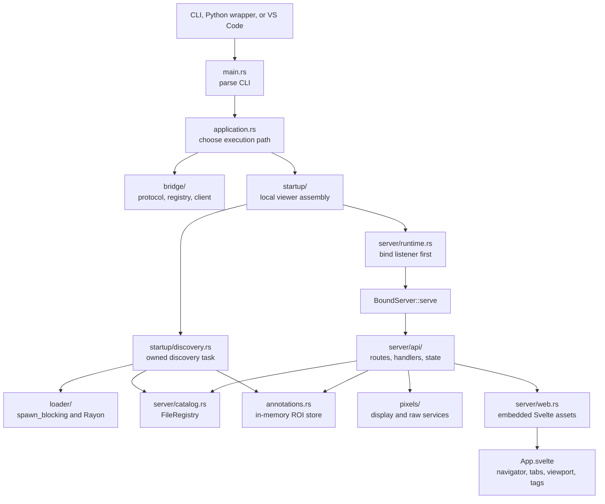
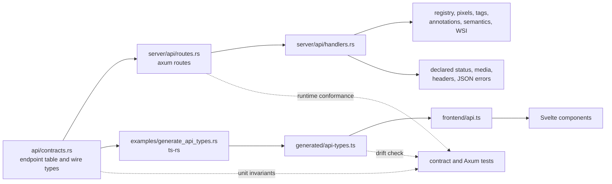
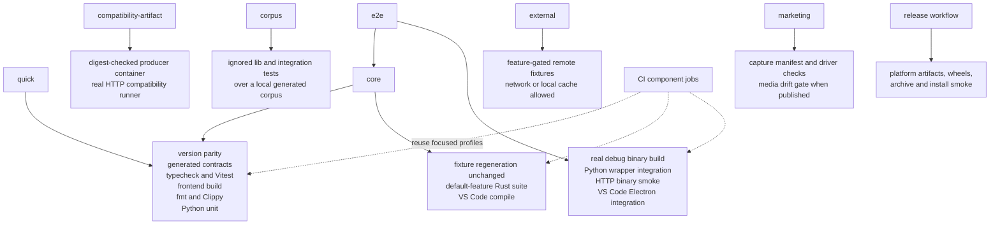

# dcmview Architecture

This document is the normative current-state architecture and testing model for
the repository. Update it when module ownership, dependency direction, HTTP
contracts, lifecycle ownership, or the canonical check profiles change.

`dcmview` is an ephemeral research and development viewer. The Rust binary is
the product center; the Svelte frontend is embedded into that binary, and the
Python and VS Code integrations launch or route to the same executable.

## Module Boundaries

The codebase is organized around explicit boundaries rather than one
application module:

| Boundary | Owner | Stable contract or seam |
|---|---|---|
| Process dispatch | `src/application.rs` | Routes a launch into VS Code through `bridge::launch_in_vscode` when the routing rule selects a bridge, otherwise runs the local viewer in-process. |
| Local startup | `src/startup/` | `LocalViewerOptions`, `LocalViewerOutcome`, and `DiscoveryHandle`. |
| HTTP wire model | `src/api/contracts.rs` | Plain `endpoints` table, media types, header names, wire structs (query names are `FrameQuery`/`TagQuery` fields), and error envelope. |
| HTTP runtime | `src/server/` | Listener/runtime, route registration, handlers, state, registry, activity tracking, tags, and embedded assets. |
| Pixel service | `src/pixels/` | Typed display/raw requests, cache behavior, transfer-syntax classification, decoding, rendering, and `PixelError`. |
| Patient geometry | `src/geometry.rs` | Normalized per-frame position, orientation, pixel spacing, coplanarity checks, and target-to-source pixel transforms. |
| Plane stacks | `src/plane_stack.rs` | RT Dose grids and Parametric Map frames as parallel planes; coverage and bracketing-plane sampling of a displayed frame. |
| Value mapping | `src/value_mapping.rs` | Per-frame Modality transform and Real World Value Mappings (or Dose Grid Scaling) that convert stored samples. |
| DICOM references | `src/references.rs` | Bounded extraction of typed instance relationships without implying target presence or semantic rendering. |
| Semantic context | `src/semantic.rs` | Conservative SEG, Parametric Map, and RT Dose metadata interpretation layered beside unchanged pixel preview. |
| WSI tile context | `src/wsi.rs` | Bounded positioning of one selected WSI tile without stitching or Total Pixel Matrix reconstruction. |
| Attribute readers | `src/dicom_values.rs` | Lenient string, number, and sequence readers shared by discovery, references, semantic context, and WSI context. |
| DICOM discovery | `src/loader/` | `discovery.rs` progressive events, cancellation, and reports; `entry.rs` `FileEntry` construction; `metadata.rs` geometry, LUT, overlay, and shutter extraction; `filter.rs` metadata filters. |
| Frontend client | `frontend/src/api.ts` | Typed fetch wrappers over the generated endpoint paths and wire types. |
| VS Code extension | `vscode/src/` | `extension.ts` wires activation only. `viewerSessions.ts` owns viewer processes and their webview panels; `customEditor.ts` and `commands.ts` open files through it; `bridgeServer.ts` serves the loopback launch/stop/wait bridge; `bridgeRegistry.ts` publishes and refreshes the registry file; `terminalInterception.ts` sets the terminal environment and PATH shims. |
| Cross-language generation | `examples/generate_api_types.rs` | Checked-in `frontend/src/generated/api-types.ts` rendered with `ts-rs` from the Rust HTTP contract. |

Axum integration tests execute the router without a process; discovery and
lifecycle tests drive the real loader; end-to-end profiles exercise a real
binary where process behavior matters.

## Runtime And Module Flow

```mermaid
flowchart TD
    launch["CLI, Python wrapper, or VS Code"] --> main["main.rs<br/>parse CLI"]
    main --> app["application.rs<br/>choose execution path"]
    app --> bridge["bridge/<br/>protocol, registry, client"]
    app --> startup["startup/<br/>local viewer assembly"]
    startup --> bind["server/runtime.rs<br/>bind listener first"]
    startup --> discovery["startup/discovery.rs<br/>owned discovery task"]
    discovery --> loader["loader/<br/>spawn_blocking and Rayon"]
    discovery --> registry["server/catalog.rs<br/>FileRegistry"]
    discovery --> annotations["annotations.rs<br/>in-memory ROI store"]
    bind --> runtime["BoundServer::serve"]
    runtime --> router["server/api/<br/>routes, handlers, state"]
    router --> pixels["pixels/<br/>display and raw services"]
    router --> registry
    router --> annotations
    router --> web["server/web.rs<br/>embedded Svelte assets"]
    web --> ui["App.svelte<br/>navigator, tabs, viewport, tags"]
```

### Ownership And Dependency Direction

The binary-private orchestration modules depend on the reusable library
modules, not the reverse:

1. `main.rs` owns the Clap shape and process exit only.
2. `application.rs` owns dispatch and tracing initialization. It unwraps the
   hidden `--vscode-bridge-client <program> <args>...` form used by the terminal
   shims and the Python wrapper, then tries the VS Code bridge, then falls back
   to local startup in the same process. Bridge routing follows one rule for
   every entry point: a process with the bridge environment (a VS Code
   terminal) may use any live bridge; any other process routes only when its
   working directory is inside a registered workspace folder. A launch that
   reached a bridge without confirmation exits instead of starting a second,
   local viewer. Only refused connections mark a registry entry stale.
3. `startup/mod.rs` validates local options and the annotation CSV header, constructs
   `FileRegistry`, `AnnotationStore`, `AppState`, and `ServerConfig`, binds the
   listener, starts discovery, serves, and joins discovery before returning.
4. `startup/discovery.rs` translates loader events into registry updates, then
   owns the cancellable blocking annotation pass. It does not own HTTP routing.
5. `server/runtime.rs` owns listener, browser, and graceful-shutdown
   resources. `server/api/` owns HTTP concerns. `server/catalog.rs` owns the
   progressive file registry.
6. `pixels/service.rs` is the server-facing pixel boundary. Codec, cache,
   rendering, and window modules remain below it. `pixels/native_layout.rs`
   validates native frame sizing and normalizes bit-packed, planar, subsampled,
   and endian-sensitive storage before display decoding. `pixels/overlay.rs`
   and `pixels/shutter.rs` own bounded native presentation compositing;
   `pixels/segmentation.rs` owns SEG mask decoding and patient-coordinate
   nearest-neighbor resampling; `pixels/rle.rs` owns the bounded Annex
   G/PackBits path. `pixels/syntax.rs` owns the codec table that both frame
   dispatch and support classification read, including which color layouts
   each codec converts.

`src/api/contracts.rs` owns browser-visible wire declarations. `src/types.rs`
owns internal DICOM, cache-key, transfer-syntax, and windowing domain types; it
re-exports selected wire types for compatibility but is not their source of
truth.

The frontend root is `App.svelte`. It composes `FileNavigator`,
`OpenImageTabs`, `ViewerToolbar`, `ImageViewport`, `FrameSlider`, `TagPanel`,
`ReferenceNavigator`, and `StatusBar`. `ReferenceNavigator` retains declared
identity when a target is absent and routes validated local file/frame matches
through the same tab and stack state as ordinary navigation; it does not imply
semantic rendering of the referencing object. Each declared edge renders through
`ReferenceEdge`, which `SemanticContextPanel` (RT Dose plan, structure set, and
image references) and `WsiTileContext` (slide relationships) reuse; WSI
companions open through the same `openReference` path. Components use
`frontend/src/api.ts`; new endpoint fetches should not be introduced directly
inside components.

`App.svelte` owns the shared root state through controllers in
`frontend/src/lib/app/` (catalog polling, tab and stack navigation, window
settings, sidebar layout) and the per-tab `ViewStates` store (zoom, pan,
orientation). One `svelte:window` keydown handler dispatches every global
shortcut through `lib/keyboardShortcuts.ts`. Keyed fetches share and abort
in-flight requests through `lib/keyedAsyncResource.ts`. `ImageViewport`
composes units in `frontend/src/lib/viewport/`: raw and display frame sources,
the window/level worker client, rendered-frame tracking for cine pacing,
per-frame overlay layers, the ROI annotation store and components, the
pixel probe and value-mapping conversions behind the readout, and the view
transform math, including the client-to-image-pixel mapping.

The pixel readout reads the frame on screen: the samples the window/level
renderer already holds, or a raw frame fetched through the shared raw-frame
source once the cursor rests, converted with that frame's `value-mapping`.
A linear real-world mapping also switches the window to its unit:
`WindowSettings` records a drag in that unit and the viewport converts it
through each frame's mapping to the Modality scale that the display query
and the raw renderer window, so a mapped value looks the same on every
frame. Files without such a mapping keep the stored-unit path unchanged.

For SEG objects, `SemanticContextPanel` keeps Pixel Preview as the initial mode
and publishes an explicit Semantic Context selection to `App.svelte`.
`ImageViewport` composes the referenced display PNG with the transparent SEG
overlay only when the selected SEG frame has one validated source-frame
mapping. The active logical frame remains the SEG frame; source identity and
geometry come from the mapping. ROI editing, interactive window/level, and cine
are disabled for the composed view because their existing state belongs to the
SEG object or requires a separate source-window contract.

RT Dose and Parametric Map colorwashes work the other way round: they
decorate the displayed image rather than replace it. `lib/app/valueOverlays`
reads the semantic context of each volume that shares a Frame of Reference
with the active file (from the series catalog) and offers the eligible ones
whose `overlay_source_frames` include a frame of the active tab; the
Overlay bar toggles one and sets its opacity, and the volume's own Semantic
Context mode can open its source image with it shown. `ImageViewport` draws
the displayed frame's `dose-overlay` or `parametric-map-overlay` PNG on a
separate canvas above whatever pipeline renders the frame, so window/level,
cine, ROIs, and the view transform keep working. Frames the context does not
list, or that answer `404 overlay_not_covering_frame`, show no layer and a
note in the legend.

`FileNavigator` owns the active clinical-versus-directory organization and
publishes the corresponding flattened file order to `App.svelte`. Global
Up/Down shortcuts use that order (including the active filter), so file
selection follows the explorer presentation rather than registry insertion
order.

`App.svelte` gives `ImageViewport` one ordered logical-frame sequence for the
active tab. A sequence may describe frames from one multiframe object, many
single-frame CT/MR objects, or a mixture of both. Viewport display and raw
resources are keyed by source file/frame identity but retained for the logical
tab lifetime, so crossing a source-file boundary does not clear already loaded
frames. Raw foreground and prefetch consumers share one in-flight request per
source frame; consumer navigation does not cancel reusable work, while logical
tab teardown aborts the request registry. Display resources use independent
byte-budgeted LRU tiers: a 320 MiB compressed PNG payload cache and a 128 MiB
decoded RGBA bitmap working set. Bitmap eviction closes only the decoded browser
resource and preserves its PNG for local re-decoding. Background display
prefetch fills the PNG tier without eagerly decoding every frame. These byte
budgets are the only active-stack discard policy; near-frame prefetch does not
prune previously visited frames. Cine resolves logical positions to source
frames and uses the same prepare-then-render cache path as manual navigation.

## Executable HTTP Contract

```mermaid
flowchart LR
    contract["api/contracts.rs<br/>endpoint table and wire types"] --> routes["server/api/routes.rs<br/>axum routes"]
    routes --> handlers["server/api/handlers.rs"]
    handlers --> services["registry, pixels, tags,<br/>annotations, semantics, WSI"]
    handlers --> responses["declared status, media,<br/>headers, JSON errors"]
    contract --> generator["examples/generate_api_types.rs<br/>ts-rs"]
    generator --> generated["generated/api-types.ts"]
    generated --> client["frontend/api.ts"]
    client --> components["Svelte components"]
    contract -. "unit invariants" .-> tests["contract and Axum tests"]
    routes -. "runtime conformance" .-> tests
    generated -. "drift check" .-> tests
```

`endpoints::ALL` is plain data: id, method, path, response media type,
response-header kind, and success status for every `/api` endpoint. The router
registers each path with an ordinary axum `.route()` call and handlers take
their typed extractors directly. Wire structs derive `serde` and `ts_rs::TS`,
so their TypeScript follows the same serde attributes as the JSON.

The contract is kept consistent by three layers:

- Rust unit tests check endpoint uniqueness and that the raw-frame header
  table covers exactly the serialized `RawFrameMetadata` fields.
- Axum integration tests request every declared endpoint with its declared
  method and compare status, media type, and response headers, and check that
  file-scoped endpoints and boundary rejections answer with the shared JSON
  error envelope. A router method that disagrees with the table fails here.
- `cargo run --example generate_api_types -- --check` (run by
  `check:contracts` and every check profile) rejects a stale generated file,
  and `tsc` checks `api.ts` against it; the generated `RAW_FRAME_HEADERS`
  must `satisfy` `Record<keyof RawFrameMetadata, string>`.

### Endpoint Invariants

- Every API error is a JSON `ErrorResponse` shaped as
  `{"code":"stable_machine_code","error":"human-readable detail"}`. Codes are
  owned by `ApiErrorCode` in the canonical Rust contract; messages may add
  context without changing automation behavior.
- `/api/health` exposes the package version plus build source revision, target,
  and profile so compatibility evidence can identify the tested viewer build.
- `/api/files` exposes a response-bounded view of the 256 most recent entries
  in the memory-only discovery ledger and each file's SOP Class, coarse object
  kind, and explicit `renderable`, `metadata_only`, or `unsupported` state with
  a stable reason when applicable. Exact scan totals remain separate. These
  states describe viewer capability, not DICOM conformance.
- `/api/series` builds an ephemeral server-owned catalog grouped strictly by
  Study and Series UID. Its typed stacks map virtual positions to source file
  and frame, prefer patient-geometry ordering for classic slices, surface
  geometry-quality warnings, use concatenation offsets for enhanced parts, and
  keep WSI pyramid levels and non-member companions distinct.
- `/api/file/{index}/references` extracts bounded typed relationships on a
  blocking worker and resolves targets against the current registry by stable
  SOP/Series identity. Declared one-based frame numbers remain visible while
  local navigation matches contain only validated zero-based frames; missing
  targets remain explicit empty matches.
- `/api/file/{index}/semantic-context` reads declared SEG, Parametric Map, and
  RT Dose meaning without modifying decoded pixels. For SEG frames, explicit
  per-frame derivation references take precedence. When those are absent, the
  resolver can match top-level declared source instances by Frame of Reference
  and per-frame patient geometry, including classic series split across many
  SOP Instances. Each result reports its mapping method and status. Pixel
  preview remains the default, every frame must resolve uniquely for aggregate
  overlay eligibility, and absent, ambiguous, or incompatible metadata is
  reported explicitly rather than inferred.
- `/api/file/{index}/frame/{frame}/segmentation-overlay` accepts one SEG frame
  whose source mapping and geometry have been validated. It decodes binary or
  fractional SEG samples, maps pixel centers through patient coordinates, and
  returns a source-sized transparent PNG using nearest-neighbor mask sampling.
  Unavailable semantic mappings return `422 semantic_mapping_unavailable`.
  Like the value overlays in `server/api/overlays.rs`, the encoded PNG is
  cached per SEG frame and resolved source frame, and `X-Cache` reports that
  cache.
- `/api/file/{index}/frame/{frame}/dose-overlay?dose=` and
  `.../parametric-map-overlay?map=` (`server/api/overlays.rs`) draw an RT Dose
  grid or Parametric Map on a displayed frame in its Frame of Reference. The
  volume is a `PlaneStack`; `StackSample` locates each displayed pixel along
  the plane normal and in the plane grid and resamples trilinearly (a
  parallel frame brackets the same planes everywhere, an oblique one per
  pixel). The planes it reaches are decoded through the raw cache and
  converted with `value_mapping`, and `pixels/colorwash.rs` encodes viridis
  over the context legend's range. A frame with no pixel inside the volume
  is `404 overlay_not_covering_frame`. Encoded PNGs are cached per volume and
  displayed frame, and `X-Cache` reports that cache. Semantic context lists
  covered source frames; the server completes its legend from the decoded
  frames' value range.
- `/api/file/{index}/frame/{frame}/value-mapping` reports the frame's
  Modality transform and real-world mappings for client-side readouts: the
  file's own, then those of loaded RWVM instances that reference the frame.
  Parsed mappings are cached per file and file set, like semantic context.
- `/api/file/{index}/wsi/frame/{frame}` returns bounded placement metadata for
  one selected tile. TILED_FULL uses deterministic raster placement;
  TILED_SPARSE uses per-frame plane positions. The contract exposes matrix,
  optical-path, focal-plane, and warning data but never promises stitching or
  slide reconstruction.
- `/api/file/{index}/tags/select` traverses explicit tag/item paths against the
  original object and pages sequence items, allowing targeted retrieval beyond
  legacy tag-tree preview caps.
- Path, query, and JSON extractor failures pass through the same envelope.
- Unknown `/api` routes return JSON `404`; unsupported methods return JSON
  `405`.
- Supported display frames return `image/png`; supported raw frames return
  `application/octet-stream`; annotation export returns
  `text/csv; charset=utf-8`.
- Every successful display or raw frame response includes `X-Cache: HIT` or
  `X-Cache: MISS`.
- Raw responses include all required `X-Frame-*` metadata headers. Default
  window headers are present only when the DICOM supplies a default window.
- Unsupported transfer syntaxes and raw layouts are `422`; missing pixels and
  out-of-range frames are `404`; decode failures are request-scoped `500`
  responses and do not stop the server.
- DICOMDIR is recognized by Media Storage Directory SOP Class and skipped with
  the stable `unsupported_media_directory` discovery reason while recursive
  discovery continues for ordinary objects. File-set hierarchy parsing and
  DICOM media support are intentionally not advertised.

Display cache keys include file, frame, normalized window parameters, and
window mode. Full-dynamic mode ignores explicit window values. Raw cache keys
include file and frame only. Cache locks are held for lookup or insertion, never
while reading DICOM, decoding, rendering, or encoding.

Native display decoding supports monochrome integer samples at 1, 8, 16, and
32 bits, Float Pixel Data, Double Float Pixel Data, 8-bit RGB in either planar
configuration, YBR_FULL, YBR_FULL_422, and palette color. Native raw responses
retain stored sample ordering (including planar configuration) while
normalizing multi-byte values to little endian. Integer sample fields are
masked to Bits Stored and signed values are extended from High Bit so unused
allocated bits never affect display or raw consumers; one-bit pixels are
expanded to one byte per sample. Float and double-float objects are pixel-renderable, but
real-world-value mapping remains a separate semantic capability (the
value-mapping endpoint and value overlays) rather than an implicit part of the
display pipeline.

The frontend uses raw frames for local interactive window/level when their
single-channel 8- or 16-bit layout is supported by the browser renderer. For
other server-renderable layouts (including one-bit, 32-bit, and floating-point
samples), selecting the window/level tool falls back to parameterized display
PNG requests instead of replacing the image with a raw-renderer error.

For supported 8-bit RGB display paths, a structurally valid source ICC profile
is preserved in the PNG `iCCP` chunk. The profile may come from the top-level
ICC Profile attribute or from Optical Path Sequence; nested profiles are used
only when every optical-path item supplies the same bytes. Missing or differing
optical-path profiles are omitted because the renderer does not yet prove a
frame-to-optical-path association. This is metadata preservation, not a numeric
color-space transformation, and it does not change decoded RGB samples or raw
frame responses.

For native monochrome display, Modality LUT or rescale precedes VOI LUT or
windowing, followed by MONOCHROME1 presentation inversion. Modality and VOI
LUT sequences accept the standard 8-bit and 16-bit entry depths, including
byte-packed 8-bit LUT Data. The display shutter then replaces every pixel
outside its opening with the encoded P-value (Shutter Presentation Value, else
the L* of Shutter Presentation Color CIELab Value, else black). The opening is
the intersection of every declared shape: rectangular, circular, polygonal,
and bitmap. Shape coordinates are one-based image rows and columns with edges
inside, and a circle's radius counts pixels along a row, so non-square pixels
keep it physically round. A bitmap shutter's overlay plane is taken out of the
overlay list at load time, so it masks the image and is never drawn.
Standalone one-bit overlay planes are composited last in DICOM LSB-first
order. These presentation operations affect PNG display frames only; raw-frame
bytes remain the decoded source samples, and any overlay or shutter marks the
file incompatible with client raw windowing.

Color display frames take the same shutter. Every color decode path converts
to interleaved RGB and ends in `render::encode_rgb8_display_png`, which fills
pixels outside the opening with the Shutter Presentation Color CIELab Value
converted from D50 PCS-values to sRGB, else the gray P-value on all three
channels; the 16-bit JPEG 2000 RGB path scales that fill to its precision.
Each frame's shutter is its Per-frame Functional Groups Frame Display Shutter,
else the Shared Functional Groups one, else the Display Shutter modules.

RLE Lossless decoding validates the 64-byte Annex G header, segment offsets,
PackBits runs, byte-plane counts, and decoded sizes before assembling a frame.
It supports 8/16-bit monochrome plus common 8-bit RGB, YBR_FULL, and palette
layouts. YBR_FULL_422 is not a standard RLE photometric interpretation, but
files that carry it hold full-resolution segments and are displayed as
YBR_FULL. DICOM byte planes are interpreted in most-significant-byte-first
order; non-conforming files with reversed 16-bit planes are not silently
reinterpreted.

JPEG-LS Lossless `.80` uses the vendored CharLS build through
`dicom-pixeldata`; the supported path is 8-bit grayscale, while `.81` remains
unsupported. JPEG XL Lossless `.110` uses the pure-Rust codec graph and retains
all interleaved channels in both PNG and raw output; YBR_RCT frames are RGB
once the decoder inverts the codestream's reversible color transform, and
three-channel frames labelled YBR_FULL are converted to RGB for display. `.111` and `.112`
remain unsupported until independently exercised. JPEG Lossless has no color
transform in its codestream, so YBR_FULL components are converted to RGB after
decoding, while JPEG Baseline relies on the decoder's own YCbCr conversion. Deflated Explicit VR Little
Endian is a dataset encoding and routes through the native layout pipeline
after `dicom-object` inflates the dataset.

See [the HTTP API reference](api.md) for endpoint payloads and headers.

## Lifecycle And Discovery Ownership

Local startup follows a strict order:

1. Validate the optional annotation CSV header.
2. Construct state and configuration.
3. Bind `BoundServer`; an occupied explicit port fails before discovery starts.
4. Spawn the owned discovery task.
5. Register stop-signal listeners (`signals::StopSignals`: Ctrl+C and SIGTERM
   on Unix, Ctrl+C and Ctrl+Break on Windows) before printing the URL, then
   serve until a stop signal, external failure notification, or idle timeout.
   The VS Code bridge client uses the same listeners.
6. Request discovery cancellation and await the discovery task, which includes
   the loader's `spawn_blocking`/Rayon work, before returning.

The loader sends one event per inspected candidate through a bounded channel.
The discovery task drains that channel while awaiting the loader, updates
`FileRegistry` (files, counts, and the bounded discovery ledger), and marks the
scan complete on every exit path, including a panic. It then streams the annotation CSV once on a cancellable
blocking worker, matching only loaded absolute path keys and committing valid
rows atomically without overwriting viewer edits. Annotation failures remain in
the annotation store and do not terminate image viewing. Scan and no-files
failures produce typed outcomes and cancel the server's shutdown token.
Normal server exit during incomplete discovery or annotation loading requests
cancellation and remains a successful process outcome.

`RequestActivity` tracks in-flight requests and a monotonic idle baseline.
Idle timeout does not start while the registry is both empty and incomplete,
and graceful shutdown lets in-flight requests drain. The browser task
is owned by `BoundServer::serve` and cleaned up on every normal return or
error.

`DiscoveryHandle::Drop` requests cancellation as a backstop. The supported
lifecycle is the explicit `cancel_and_wait` path; callers that later embed
startup in an abortable Tokio task must add a supervisor contract if they need
join guarantees after hard task abortion.

## Test Layers And Check Profiles

```mermaid
flowchart TD
    quick["quick"] --> qlayers["version parity<br/>generated contracts<br/>typecheck and Vitest<br/>frontend build<br/>fmt and Clippy<br/>Python unit"]
    core["core"] --> qlayers
    core --> clayers["fixture regeneration unchanged<br/>default-feature Rust suite<br/>VS Code compile"]
    e2e["e2e"] --> core
    e2e --> elayers["real debug binary build<br/>Python wrapper integration<br/>HTTP binary smoke<br/>VS Code Electron integration"]
    artifact["compatibility-artifact"] --> alayers["digest-checked producer container<br/>real HTTP compatibility runner"]
    corpus["corpus"] --> players["ignored lib and integration tests<br/>over a local generated corpus"]
    external["external"] --> xlayers["feature-gated remote fixtures<br/>network or local cache allowed"]
    marketing["marketing"] --> mlayers["capture manifest and driver checks<br/>media drift gate when published"]
    ci["CI component jobs"] -. "reuse focused profiles" .-> qlayers
    ci -.-> clayers
    ci -.-> elayers
    release["release workflow"] --> rlayers["platform artifacts, wheels,<br/>archive and install smoke"]
```

`scripts/check.py` is the canonical check entry point:

The supported development baselines are Rust 1.88+, Node.js 20.19+, and Python
3.9+. CI pins Rust 1.88 and the current Node 20 line.

| Profile | Intended use | Exact coverage |
|---|---|---|
| `quick` | Normal development loop | Version parity; generated frontend contract check; Svelte/TypeScript checks; Vitest; frontend build; Rust format and strict all-target Clippy; Python unit, packaging-helper, and compatibility-runner unit tests. It does not run Rust tests or VS Code tests. |
| `core` | Before handing off a normal code change | Everything in the corresponding frontend/lint/unit layers, plus deterministic fixture regeneration that must leave the current fixture tree unchanged, the default-feature, non-ignored locked Rust suite, and VS Code compilation. |
| `e2e` | Process or integration changes | `core`, then a real debug binary, Python wrapper binary integration, debug-binary HTTP smoke, and VS Code Electron integration, which opens a fixture through the extension's custom editor and terminal shim against the debug binary. |
| `compatibility-artifact` | Stored current corpus integration | Builds only the dcmview binary, verifies an explicitly supplied producer container (`DCMVIEW_COMPAT_CORPUS_ROOT`), and runs `scripts/compatibility/run.py` against every verified DICOM payload. It never checks out or builds the generator and fails when no container is supplied. It is run locally only; no CI workflow runs it. |
| `corpus` | Stored generated corpus, unit and integration level | Builds frontend assets and runs every ignored lib and integration test except the remote-fixture ones, with `DCMVIEW_PREPARED_CORPUS` set from `--corpus PATH` or the environment. Those tests read cases from a local dicom-test-suite corpus, either one flat `all` corpus or per-profile `core`/`extended`/`extended-deflate` roots; the ICC test's JPEG XL and JPEG 2000 re-encodings run only when their per-profile roots exist. It fails before building when the corpus is unset or not a directory, never generates one, and no CI workflow runs it. |
| `external` | Opt-in upstream DICOM compatibility | Builds frontend assets and runs only ignored integration tests behind `remote-fixtures`; those tests may download or populate the `dicom-test-files` cache. It is separate from `e2e`. |
| `marketing` | Capture tooling and release media | Validates tracked source/capture manifests, syntax-checks the browser and VS Code capture drivers, runs marketing-media unit tests, and—once an approved bundle is committed—verifies published hashes and the capture-input digest without ignored DICOM sources. |

Pass `--install` when the profile should run `npm ci` for the frontend and, when
needed, VS Code dependencies. Without it, installed dependencies are reused.
CI invokes focused profiles in separate jobs so failures identify the affected
layer; the aggregate profiles remain the local source of truth. Dependency
installation and VS Code Electron integration can also use network/cache state;
`external` specifically denotes upstream DICOM fixture coverage.

### What Each Layer Covers

- Discovery lifecycle tests drive the real loader over copies of committed
  fixtures for completion, cancellation, annotation failure, no-files, and
  all-filtered cases.
- `BoundServer::bind` is separate from `serve`, so bind ordering and occupied
  ports are deterministic.
- `server::router(AppState)` supports in-process `axum-test` coverage for the
  complete HTTP boundary.
- Generated DICOM fixtures exercise real discovery and codec paths. Integration
  tests do not mock the DICOM layer.
- Discovery stops metadata parsing at the earliest standard pixel-data tag, then
  walks element headers (inflating deflated data sets) to find the data set's
  own top-level pixel element. Pixel elements nested in sequences, such as an
  Icon Image Sequence, do not count. It
  does not retain integer, float, or double-float pixel values in the catalog.
- Frontend state helpers, controllers, cache policy, windowing, registry
  shaping, and API wrappers are tested as TypeScript modules. Component tests
  render `App.svelte` and `ImageViewport.svelte` in happy-dom with the API
  module mocked, covering per-tab view state, the keyboard guard, and the
  window/level render-path choice.
- `tests/windowing-cases.json` is the shared windowing oracle: stored samples,
  rescale, photometric interpretation, DICOM window, Pixel Padding, and the
  request, with expected 8-bit output from PS3.3 C.11.2.1.2.1. The Rust
  integration test writes each case as a DICOM file and runs it through the
  loader, `AppState`, and the display and raw endpoints; `rawWindowing.test.ts`
  renders the same cases client-side. Server and client windowing must agree
  on every case.
- The `X-Cache` MISS-then-HIT sequence is asserted once per cached endpoint
  (display frame, raw frame) plus the display cache-key tests for window
  override and window mode; the runtime contract test checks every cached
  endpoint returns a valid `X-Cache` value. Codec tests assert decode results,
  not cache state.
- Error assertions use the JSON envelope's stable `code`, not message text.
- Python unit tests isolate subprocess policy; `python-integration` adds the real
  binary. VS Code compile and Electron integration remain separate layers.
- `scripts/compatibility/run.py --corpus-root` checks the real binary against
  a stored `synth-dicom-gen` smoke container (`smoke.tar.gz` plus
  `artifact-index.json`) after verifying the archive digest and every payload
  hash. Its pixel oracles come from the generator's manifest, independent of
  dcmview: every raw frame hash, JPEG Baseline error bounds, and an exact 8-bit
  display frame computed from the recipe samples, rescale, LINEAR window, and
  photometric interpretation. Layouts the manifest cannot describe (LUT and
  palette tables, YBR color, overlays, shutters) are reported as not
  computable. The corpus is handled locally only; no CI workflow runs it. For
  codec or display changes, every check that passed on the base commit must
  still pass. See `scripts/compatibility/README.md`.
- No profile automates a real browser. Manual acceptance uses the actual
  Svelte app and fixture server to exercise canvas/network behavior: metadata-only and unsupported states,
  pixel-preview/semantic-context switching, typed references, SEG/Parametric
  Map/RT Dose context and colorwash overlays, the pixel readout, real-world
  window/level, WSI positioning, cine, windowing, viewport transforms,
  file switching, and recovery after request errors.
- `python/tests/test_check_profiles.py` locks the documented
  `quick`/`core`/`e2e` composition and the exact independent `external` and
  `corpus` commands without launching toolchains.

### Intentionally External Coverage

- Two upstream `dicom-test-files` cases are ignored in normal Rust runs and live
  in the `external` profile because they can use network and cache state: one
  loader/API metadata case and one JPEG 2000 display/cache case. Committed JPEG
  2000 fixtures remain in normal coverage. No CI or release job invokes
  `external`.
- Release workflows, not `core`, prove platform archives, bundled wheels,
  installed console scripts, VSIX packaging, and release-binary smoke behavior.
- Eight Rust tests (six unit, two integration) are ignored in normal runs
  because they read a locally generated dicom-test-suite corpus; the `corpus`
  profile runs them. Resolve their case files through
  `loader::prepared_corpus_case` or `support::prepared_corpus_case`.
- Institution-specific DICOM corpora are not committed test dependencies;
  broader compatibility is manual or reported with de-identified data.
- Performance targets require explicit timing and memory instrumentation. They
  are not inferred from mocked or ordinary correctness tests.

## Extension Points

Not current correctness blockers:

1. If local startup is ever exposed as an abortable library API, introduce an
   explicit supervisor/reaper contract for hard task abortion; the binary's
   current result-based lifecycle already joins its work.
2. Add opt-in performance benchmarks before enforcing startup, first-frame, or
   cache-memory thresholds in CI.
3. Keep external upstream fixtures opt-in unless their availability and cache
   behavior become deterministic enough for normal CI.
4. When adding an endpoint, add it to `endpoints` in the Rust contract,
   register its route, regenerate the checked-in TypeScript, and add a wrapper
   in `frontend/src/api.ts`; the runtime contract test covers it through
   `endpoints::ALL`.

## Maintainer Invariants

- Bind loopback by default; preserve warnings for non-loopback binds.
- Keep the server ephemeral: no database, persistent configuration, or DICOM
  mutation.
- Keep bridge and local startup mutually exclusive at the dispatch boundary.
- Bind before starting discovery, and join discovery on every supported server
  exit or error path.
- Keep CPU, codec, filesystem, and Rayon work off the async executor.
- Do not hold cache or registry locks across I/O, decode, encode, or await.
- Treat `src/api/contracts.rs` plus its generated TypeScript as one contract.
- Add endpoint fetches through `frontend/src/api.ts`.
- Use generated synthetic fixtures for integration coverage; never commit PHI.
- Run the narrow profile while iterating, then the profile required by the
  highest boundary changed.
- Keep the stored external-corpus consumer local: no CI workflow runs it, and
  it must not acquire, build, or invoke `synth-dicom-gen`.
